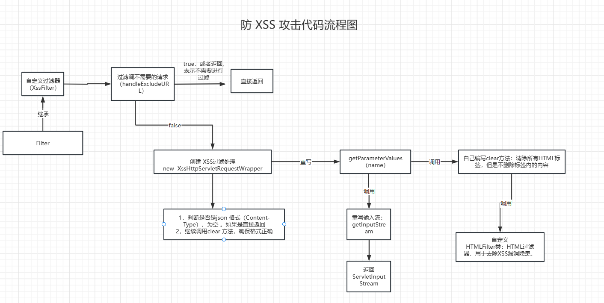

> **參考文章：**
> [详解Xss 及SpringBoot 防范Xss攻击（附全部代码）](https://www.cnblogs.com/blbl-blog/p/17188558.html "详解Xss 及SpringBoot 防范Xss攻击（附全部代码）")

Xss 攻击是对入参或者说输出进行修改，劫持内容达到目的。因此我们需要对整个系统的提交进行过滤和转义。

spring boot 防范 XSS 攻击可以使用过滤器，对内容进行转义，过滤。

这里就采用 `Spring boot+Filter` 的方式实现一个 `Xss` 的全局过滤器 :

- 自定义过滤器
- 重写 `HttpServletRequestWrapper`、 重写 `getHeader()`、`getParameter()`、`getParameterValues()`、`getInputStream()` 实现对传统“键值对”传参方式的过滤
- 重写 `getInputStream()` 实现对 `Json` 方式传参的过滤,也就是 `@RequestBody` 参数

**防 XSS 攻击流程图：**



---

# 一、先搞清楚：使用者輸入是怎麼進到後端的？

在 Servlet / Spring MVC 這類框架中，**HTTP 請求資料主要有兩條通道**：

1. **參數系統（Parameters）**

    * 來源：

        * URL Query String：`GET /search?keyword=<script>...`
        * 表單提交：`application/x-www-form-urlencoded`、`multipart/form-data`
    * 取得方式：

        * `getParameter(name)`
        * `getParameterValues(name)`
        * `getParameterMap()`
    * 框架使用場景：

        * `@RequestParam`
        * `@ModelAttribute`
        * 傳統 form 表單綁定

2. **請求 Body（Request Body）**

    * 來源：

        * JSON：`Content-Type: application/json`
        * 其他純文字或二進位格式
    * 取得方式：

        * `getInputStream()`（二進位）
        * `getReader()`（文字）
    * 框架使用場景：

        * `@RequestBody`（例如 Spring 用 `HttpMessageConverter` 去讀 `getInputStream()`）

結論：
**只要掌握「參數通道」和「body 通道」，就能攔住大部分進系統的輸入。**
這也是為什麼 Wrapper 只鎖定這兩塊下手。

---

# 二、為什麼要重寫 `getParameterValues`？

### 1. 參數系統是 Query / Form 的主要入口

所有透過 Query String、表單欄位送進來的資料，在 Servlet 規格裡都會被解析進「參數系統」：

* 使用者輸入 → Servlet container 解析 → 放到內部的 parameter map
* 後續程式碼、框架透過 `getParameter*` 系列去拿值

只要在 Wrapper 的 `getParameterValues` 裡做處理：

```java
@Override
public String[] getParameterValues(String name) {
    String[] values = super.getParameterValues(name);
    if (values != null) {
        String[] escapesValues = new String[values.length];
        for (int i = 0; i < values.length; i++) {
            escapesValues[i] = EscapeUtil.clean(values[i]).trim();
        }
        return escapesValues;
    }
    return super.getParameterValues(name);
}
```

效果是：

* 任何呼叫 `request.getParameterValues(name)` 的地方，拿到的**都是被 `EscapeUtil.clean()` 處理過的乾淨資料**。
* 包含：

    * 框架做資料綁定（例如 Spring 綁定 form 到物件）
    * 自己手動呼叫 `getParameterValues` 的地方

### 2. 多值欄位與框架內部實作

`getParameterValues` 專門用來處理**同名多值欄位**（例如 checkbox，多選下拉），很多框架內部會以它為底層來源，再包出 `getParameter` 等方法。

透過覆寫 `getParameterValues` 可以：

* 集中處理所有「多值」欄位
* 在某些容器／框架實作下，連帶影響 `getParameter`、`getParameterMap` 的結果

雖然最保險的作法是連 `getParameter`、`getParameterMap` 一起覆寫，但就若依程式碼的設計來看，選擇的是：

* 把防護核心放在「多值入口」
* 依賴容器／框架對 `getParameter*` 的實作關係來達到覆蓋率

### 3. 與 XSS 的關聯

XSS 攻擊往往是：

* 使用者在輸入欄位中放 `<script>...</script>` 或惡意 HTML / JS
* 後端不過濾就存起來或直接輸出到前端 HTML

在 `getParameterValues` 裡統一呼叫 `EscapeUtil.clean()`，可以保證：

* 所有經由 Query / Form 進來、再經由 `getParameterValues` 讀出的字串都經過「HTML / JS 特殊字元的編碼或清洗」
* 降低之後在 JSP / Thymeleaf / 前端模板渲染時的 XSS 風險

---

# 三、為什麼要重寫 `getInputStream`？

### 1. JSON / 原始 Body 的唯一來源

當請求是 `Content-Type: application/json` 等情境時：

* Servlet **不會自動幫你拆成 parameter**
* Spring 的 `@RequestBody`、Jackson 等，是直接用 `request.getInputStream()` 去讀 body
* 如果你不在 `getInputStream()` 這一層動手：

    * JSON payload 會原樣被反序列化成 Java 物件
    * 惡意字串就會在系統內部被到處傳遞（DB、log、畫面回傳等）

Wrapper 裡重寫 `getInputStream` 的邏輯：

```java
@Override
public ServletInputStream getInputStream() throws IOException {
    if (!isJsonRequest()) {
        return super.getInputStream();
    }

    String json = IOUtils.toString(super.getInputStream(), "utf-8");
    if (StringUtils.isEmpty(json)) {
        return super.getInputStream();
    }

    json = EscapeUtil.clean(json).trim();
    byte[] jsonBytes = json.getBytes("utf-8");
    final ByteArrayInputStream bis = new ByteArrayInputStream(jsonBytes);
    return new ServletInputStream() { ... };
}
```

關鍵點：

1. **只針對 JSON 請求處理**（`Content-Type: application/json`）
2. 先把原始 body 讀出來 → `json`
3. 對 `json` 做 XSS 清洗：`EscapeUtil.clean(json)`
4. 用清洗後的字串重新建立一個 `ByteArrayInputStream`，再包成自製的 `ServletInputStream`
5. 後面 `@RequestBody` / `HttpMessageConverter` 再去讀這個 stream，看見的就是**改寫過、已清洗的 JSON**

### 2. 為什麼必須「自己包一個新的 `ServletInputStream`」？

`InputStream` 的特性：

* 讀一次就消耗位置，不能任意重讀
* 你在 Filter 裡先把 `super.getInputStream()` 全部讀完，如果不重新包裝：

    * 後面的程式（例如 Spring MVC）再呼叫 `getInputStream()` 時，就讀不到東西了

因此步驟必須是：

1. Filter 裡先讀出原始 body → 轉成字串 → 做 XSS 清洗
2. 把清洗後的結果塞回一個新的 `ByteArrayInputStream`
3. 提供一個新的 `ServletInputStream`，內部實作就是讀 `ByteArrayInputStream`
4. 之後所有讀 body 的地方都會讀到「處理過」的資料

這樣才能在「不破壞框架正常讀取行為」的前提下，加上一層 XSS 防護。

### 3. 與 XSS 的關聯

現代 REST API 幾乎都用 JSON 交互，例如：

```json
{
  "content": "<script>alert(1)</script>"
}
```

如果 body 不先清洗，這段文字就會變成：

* Java 物件的欄位值
* 可能被儲存到 DB，之後再輸出到前端頁面
* 前端在 HTML 中顯示時，一旦沒做好 escaping，就會直接執行 `<script>...`

因此：

* **重寫 `getInputStream` 等於在所有 `@RequestBody` JSON 進來之前，先做一次中間清洗層**

---

# 四、兩者的角色總結對比

| 方法名                  | 攔截的東西              | 典型來源                   | 常見使用場景                  | 對 XSS 防護的意義                   |
| -------------------- | ------------------ | ---------------------- | ----------------------- | ----------------------------- |
| `getParameterValues` | 參數系統（多值）           | Query String、Form 欄位   | `@RequestParam`、表單綁定    | 擋住透過 URL / Form 送進來的惡意字串      |
| `getInputStream`     | 原始請求 body（尤其 JSON） | `application/json` 等內容 | `@RequestBody`、手動讀 body | 擋住透過 JSON / REST API 送進來的惡意字串 |

**重點結論：**

* `getParameterValues` → 鎖住「傳統參數管道」：Query + Form。
* `getInputStream` → 鎖住「現代 REST 管道」：JSON body。

這兩個一起重寫，就能在「大部分 Web 請求進入應用程式之前」統一做 XSS 清洗。你可以把它理解為：

> **把所有從 HTTP 進來的資料，在最早被讀取的兩個入口（parameter / body）統一過一層 `EscapeUtil.clean()`。**

這就是為什麼 `XssHttpServletRequestWrapper` 要重寫這兩個方法的本質原因。

---