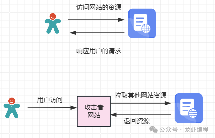

> **參考文章：**
> [防盗链技术详解与SpringBoot实现方案](https://juejin.cn/post/7559435342690435091 "防盗链技术详解与SpringBoot实现方案")
> [五种常见实现防盗链功能的方案](https://www.51cto.com/article/805898.html "五种常见实现防盗链功能的方案")

> 防盗链技术是保护网站资源不被非法盗用的重要手段，尤其在当今互联网环境中，图片、视频等多媒体资源容易被其他站点直接引用，导致带宽消耗、版权侵犯等问题。

# 1. 什么是防盗链

防盗链是一种防止未授权网站通过链接直接访问本网站资源（如图片、视频、文件等）的技术手段。

盗链行为是指其他网站在其页面中嵌入指向我们网站资源的链接，让用户在其网站上看似正常访问这些资源，实则消耗的是我们网站的带宽和服务器资源。

如下图所示盗取资源的过程图：

# 2. 盗链的危害

盗链行为会带来多方面的问题：

- 流量损失：盗链消耗服务器带宽，增加流量费用
- 成本增加：CDN和服务器费用可能因非法使用而飙升
- 版权侵犯：原创内容被非法使用和传播
- SEO影响：搜索引擎排名可能因资源被滥用而下降

# 3. 防盗链的基本原理

防盗链技术主要通过验证请求来源的合法性来保护资源，常见方法包括：

- Referer验证：检查HTTP请求头中的Referer字段，判断请求是否来自合法来源
- Token验证：为每个请求生成唯一令牌，验证其有效性
- 时间戳验证：将时间戳作为参数，只允许有效期内的请求
- IP地址验证：限制只允许特定IP地址访问资源
- 用户认证：要求用户登录后才能访问资源