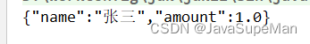
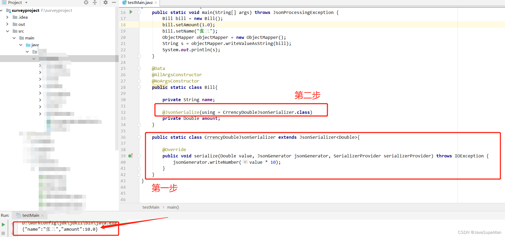
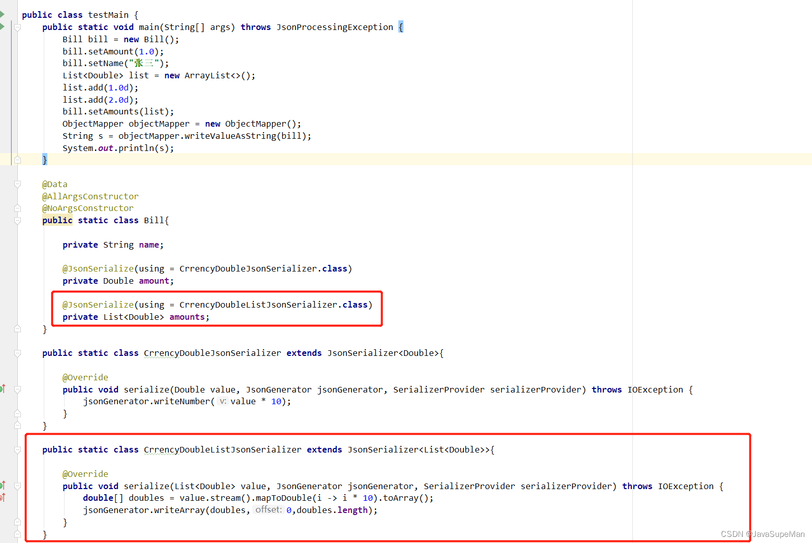
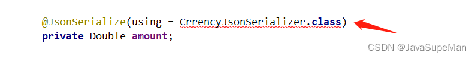
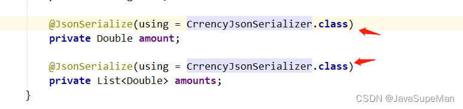
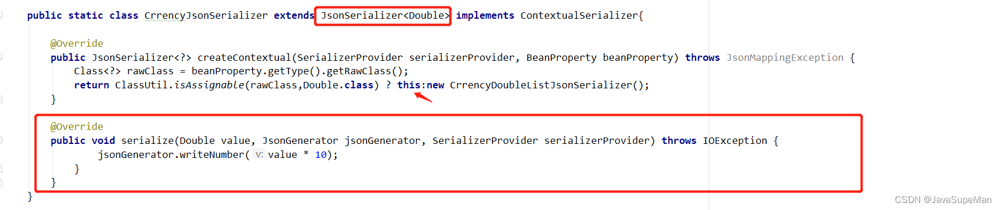
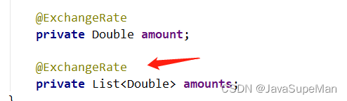

举例：自定义序列化器，让输出 json 的指定字段金额 × 10

```java
public class testMain {
    public static void main(String[] args) throws JsonProcessingException {
        Bill bill = new Bill();
        bill.setAmount(1.0);
        bill.setName("张三");
        ObjectMapper objectMapper = new ObjectMapper();
        String s = objectMapper.writeValueAsString(bill);
        System.out.println(s);
    }

    @Data
    @AllArgsConstructor
    @NoArgsConstructor
    public static class Bill {

        private String name;

        private Double amount;
    }
}
```

输出结果：



做法：实现接口 `JsonSerializer`，自定义一个序列化器



**刚才指定的字段是Double类型的，那如果是List类型呢？**

笨方法：再指定一个新的序列化器，然后不同的类型指定不同的序列化器



**能否简化？指定同一个类，然后根据具体的类型去返回到具体的序列化器**

实现接口 `ContextualSerializer`，判断类型然后返回具体的序列化器

```java
public static class CrrencyJsonSerializerimplements ContextualSerializer{

    @Override
    public JsonSerializer<?> createContextual(SerializerProvider serializerProvider, BeanProperty beanProperty) throws JsonMappingException {
        Class<?> rawClass = beanProperty.getType().getRawClass();
        return ClassUtil.isAssignable(rawClass,Double.class)?new CrrencyDoubleJsonSerializer():new CrrencyDoubleListJsonSerializer();
    }
}
```

但是使用的话会发现不能使用，是因为这个接口并没有实现 `JsonSerializer` 类



解决方法，实现 `JsonSerializer` 类

```java
public static class CrrencyJsonSerializer extends JsonSerializer<Object> implements ContextualSerializer{

    @Override
    public JsonSerializer<?> createContextual(SerializerProvider serializerProvider, BeanProperty beanProperty) throws JsonMappingException {
        Class<?> rawClass = beanProperty.getType().getRawClass();
        return ClassUtil.isAssignable(rawClass,Double.class)?new CrrencyDoubleJsonSerializer():new CrrencyDoubleListJsonSerializer();
    }

    @Override
    public void serialize(Object o, JsonGenerator jsonGenerator, SerializerProvider serializerProvider) throws IOException {

    }
}
```



方法解析：这里面的 `serialize` 重写方法是会在 `JsonSerializer` 方法后面执行，所以这块的 `serialize` 方法是无用的，当然还可以更简化



本身作为double类型的序列化器，然后判断类型如果不是double再走List的序列化器

**还能延伸！接着简化**

如果我不想用 `@JsonSerialize(using = CrrencyJsonSerializer.class)` 注解去标识呢？我觉得太繁琐，我想使用自定义注解去搞
走起！

1.定义一个自定义注解：

```java
@Target({ElementType.METHOD,ElementType.FIELD})
@Retention(RetentionPolicy.RUNTIME)
//该注解是标注是json注解，底层实现，不加的话不会生效
@JacksonAnnotationsInside
//在这去使用这个注解
@JsonSerialize(using = CrrencyJsonSerializer.class)
public @interface ExchangeRate{

}
```

2.使用



**是不是更简洁了！**