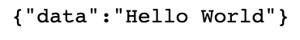

> **參考文章：**
> [Redis 使用lua脚本最全教程](https://blog.csdn.net/le_17_4_6/article/details/117588021 "Redis 使用lua脚本最全教程")
> [Redis中使用Lua脚本（一）](https://zhuanlan.zhihu.com/p/77484377 "Redis中使用Lua脚本（一）")
> [了解Redis的Lua脚本简易使用](https://blog.csdn.net/weixin_38106322/article/details/107947507 "了解Redis的Lua脚本简易使用")

# 一、简介

### `Redis` 中为什么引入 `Lua` 脚本？

`Redis` 是高性能的 `key-value` 内存数据库，在部分场景下，是对关系数据库的良好补充。

`Redis` 提供了非常丰富的指令集，官网上提供了200多个命令。但是某些特定领域，需要扩充若干指令原子性执行时，仅使用原生命令便无法完成。

`Redis` 为这样的用户场景提供了 `lua` 脚本支持，用户可以向服务器发送 `lua` 脚本来执行自定义动作，获取脚本的响应数据。`Redis` 服务器会单线程原子性执行 `lua` 脚本，保证 `lua` 脚本在处理的过程中不会被任意其它请求打断。

`Redis` 意识到上述问题后，在 `2.6` 版本推出了 `lua` 脚本功能，允许开发者使用 `Lua` 语言编写脚本传到 `Redis` 中执行。使用脚本的好处如下:
- 减少网络开销。可以将多个请求通过脚本的形式一次发送，减少网络时延。
- 原子操作。`Redis` 会将整个脚本作为一个整体执行，中间不会被其他请求插入。因此在脚本运行过程中无需担心会出现竞态条件，无需使用事务。
- 复用。客户端发送的脚本会永久存在 `redis` 中，这样其他客户端可以复用这一脚本，而不需要使用代码完成相同的逻辑。

### 什么是Lua？

- `Lua` 是一种轻量小巧的脚本语言，用标准C语言编写并以源代码形式开放。

- 其设计目的就是为了嵌入应用程序中，从而为应用程序提供灵活的扩展和定制功能。因为广泛的应用于：游戏开发、独立应用脚本、Web 应用脚本、扩展和数据库插件等。

- 比如：`Lua` 脚本用在很多游戏上，主要是 `Lua` 脚本可以嵌入到其他程序中运行，游戏升级的时候，可以直接升级脚本，而不用重新安装游戏。

- `Lua` 脚本的基本语法可参考：[菜鸟教程](https://www.runoob.com/lua/lua-tutorial.html "菜鸟教程")

# 使用

`Spring` 提供了 `RedisScript` 接口，方便开发者调用 `Lua` 脚本。

先看看 `RedisScript` 接口有什么方法，如下：

```java
public interface RedisScript<T> {
   //该方法用来获取脚本的SHA1
    String getSha1();
   //用来获取返回类型
    @Nullable
    Class<T> getResultType();
   //用来获取脚本字符串
    String getScriptAsString();
}
```

然后看看 `RedisScript` 接口的实现类有哪些？发现只有一个默认实现类 `DefaultRedisScript`，那么接下来使用 `DefaultRedisScript` 来完成一个简易的 `Lua` 脚本，代码 `demo` 如下：

```java
@GetMapping("/testLua")
@ResponseBody
public Map<String, Object> testLua() {
    DefaultRedisScript redisScript = new DefaultRedisScript();
    //设置返回类型，这步必须要设置
    redisScript.setResultType(String.class);
    //设置脚本
    redisScript.setScriptText("return 'Hello World'");
    //获取到字符串序列化器
    RedisSerializer<String> stringRedisSerializer = redisTemplate.getStringSerializer();
    //执行
    Object result = redisTemplate.execute(redisScript, stringRedisSerializer, stringRedisSerializer, null);
    Map<String, Object> map = new HashMap<>();
    map.put("data", result);
    return map;
}
```

浏览器访问该接口，结果如下：



可以成功返回脚本结果。