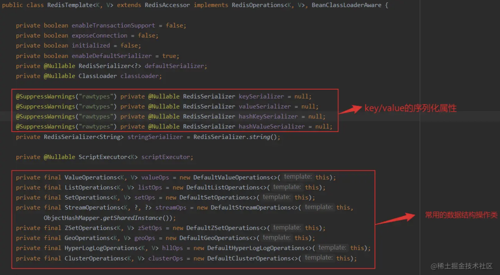
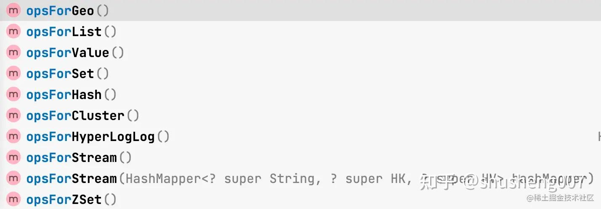
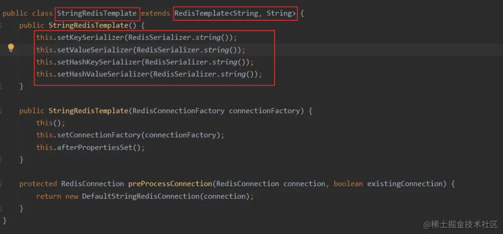
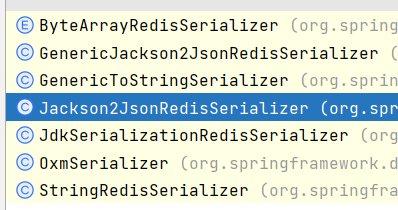
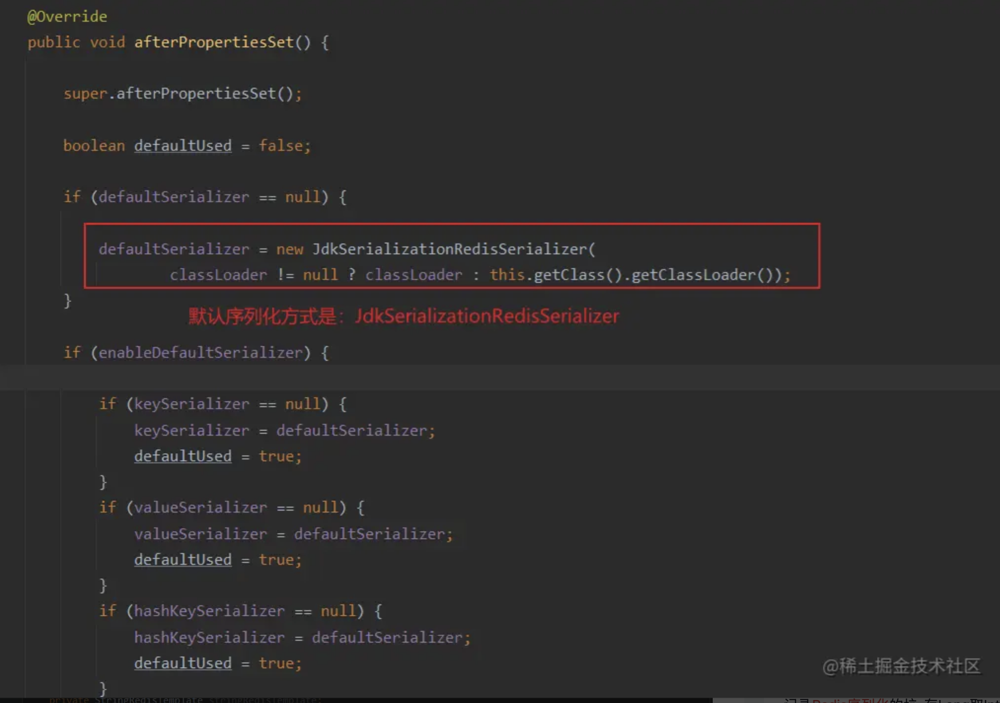
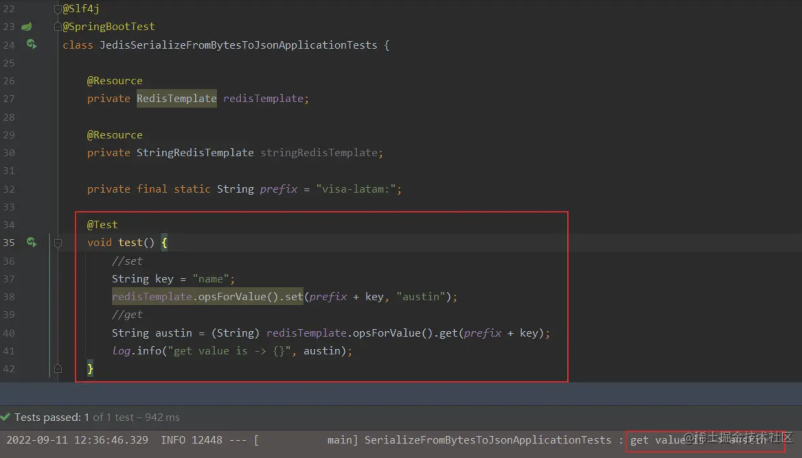
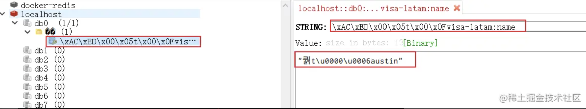
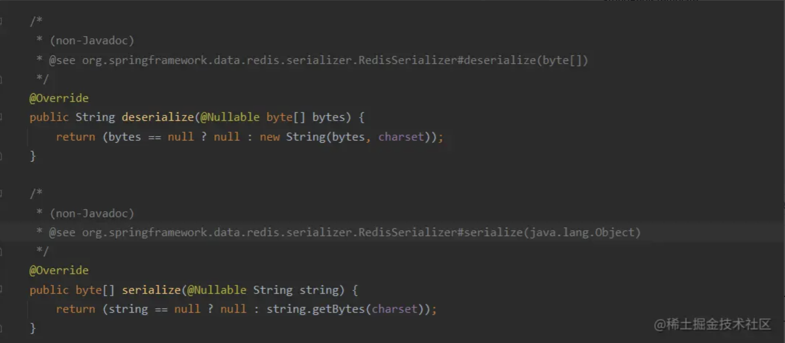

> **參考文章：**
> - [【springboot】RestTemplate序列化RedisSerializer到底该选哪个](https://blog.csdn.net/u022812849/article/details/131678160 "【springboot】RestTemplate序列化RedisSerializer到底该选哪个") 
> - [聊聊RedisTemplate的各种序列化器](https://zhuanlan.zhihu.com/p/686881442 "聊聊RedisTemplate的各种序列化器")
> - [RedisTemplate这玩意到底儿咋用啊](https://www.cnblogs.com/lilpig/p/16552227.html "RedisTemplate这玩意到底儿咋用啊")

# RedisTemplate



可以看到 `4` 个序列化相关的属性 ，主要是用于 `KEY` 和 `VALUE` 的序列化，比如说我们经常会将 `POJO` 对象存储到 `Redis` 中，一般情况下会使用 `JSON` 方式序列化成字符串存储到 `Redis` 中。

- Spring 提供的 Redis 数据结构的操作类
  - `ValueOperations` 类，提供 Redis String API 操作
  - `ListOperations` 类，提供 Redis List API 操作
  - `SetOperations` 类，提供 Redis Set API 操作
  - `ZSetOperations` 类，提供 Redis ZSet(Sorted Set) API 操作
  - `GeoOperations` 类，提供 Redis Geo API 操作
  - `HyperLogLogOperations` 类，提供 Redis HyperLogLog API 操作

使用 `RedisTemplate` 可以对 `Redis` 的各种数据结构进行操作，如下图所示。



# StringRedisTemplate

`RedisTemplate` 支持泛型，S`tringRedisTemplate` K/V 均为 String 类型。

`org.springframework.data.redis.core.StringRedisTemplate` 继承 `RedisTemplate` 类，使用 `org.springframework.data.redis.serializer.StringRedisSerializer` 字符串序列化方式。



# RedisSerializer 序列化接口
> `RedisSerializer` 接口是 `Redis` 序列化接口，用于 `Redis KEY` 和 `VALUE` 的序列化。

### 作用和原理
那我们为什么需要序列化器呢，这是个啥玩意儿？

现在闭目思考一下我们是如何使用 `redis` 的？ 是不是先将数据存储在 `redis` 上，然后用的时候再读取出来？

那我们存储在 `redis` 里的内容是啥呢？有时是字符串，例如 `"ShuSheng007"`，大部分时间是对象，例如 `Student`、`List<Student>`、`Map<String,Student>` 等等。

这些个对象肯定是不能直接存储到 `redis` 上的，我们需要想办法先把它们转成 `byte[]` 后才能存储到 `redis` 上，这就是所谓的 **序列化**。

等用的时候还的把 `byte[]` 转化为相应的对象，这就是所谓的 **反序列化**。

序列化器就是完成这两个功能的。

下面是 `Spring` 中 `Redis` 序列化器的接口，从源码中可以非常清晰的看到它就干了这两个事情。

```java
public interface RedisSerializer<T> {

    @Nullable
    byte[] serialize(@Nullable T t) throws SerializationException;

    @Nullable
    T deserialize(@Nullable byte[] bytes) throws SerializationException;
}
```

它的实现类有下面这些：



从实现类的名字可以看出，其中有将对象转换为 json 的，有使用 JDK 自带的序列化机制进行序列化反序列化的，有专门处理 String 的...

默认情况下，`RedisTemplate` 使用 `JdkSerializationRedisSerializer`，也就是 `JDK` 默认的序列化机制来进行序列化。

# JDK序列化方式(默认)
`org.springframework.data.redis.serializer.JdkSerializationRedisSerializer`，默认不配置的情况 `RedisTemplate` 采用的是该数据序列化方式，可以查看一下源码：



绝大多数情况下，并不推荐使用 `JdkSerializationRedisSerializer` 进行序列化。主要是不方便人工排查数据。我们来做个测试：



运行单元测试：



> key 被序列化成这样，线上通过 key 去查询对应的 value 非常不方便，所以 key 肯定是不能被这样序列化的。
> value 被序列化成这样，除了阅读可能困难一点，不支持跨语言外，实际上也没多大问题。不过，实际线上场景，还是使用 JSON 序列化居多。

# string序列化方式
`org.springframework.data.redis.serializer.StringRedisSerializer`，字符串和二进制数组都直接转换：



> 默认的话，`StringRedisTemplate` 的 key 和 value 采用的就是这种序列化方案。

# JSON序列化方式
> GenericJackson2JsonRedisSerializer

`org.springframework.data.redis.serializer.GenericJackson2JsonRedisSerializer` 使用 Jackson 实现 JSON 的序列化方式

`Generic` 单词翻译过来表示：通用的意思，可以看出，是支持所有类。
