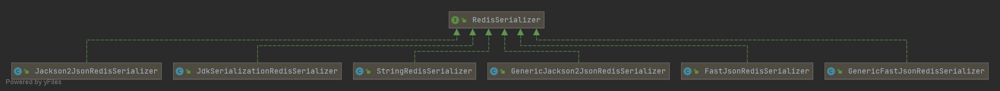

> **參考文章：**
> [【springboot】RestTemplate序列化RedisSerializer到底该选哪个](https://blog.csdn.net/u022812849/article/details/131678160 "【springboot】RestTemplate序列化RedisSerializer到底该选哪个") 
> [聊聊RedisTemplate的各种序列化器](https://zhuanlan.zhihu.com/p/686881442 "聊聊RedisTemplate的各种序列化器")
> [RedisTemplate这玩意到底儿咋用啊](https://www.cnblogs.com/lilpig/p/16552227.html "RedisTemplate这玩意到底儿咋用啊")

# 序列化器

众所周知，使用RedisTemplate可以对Redis的各种数据结构进行操作，如下图所示。


# 作用和原理

那我们为什么需要序列化器呢，这是个啥玩意儿？

现在闭目思考一下我们是如何使用redis的？是不是先将数据存储在redis上，然后用的时候再读取出来？

那我们存储在redis里的内容是啥呢？有时是字符串，例如"ShuSheng007"，大部分时间是对象， 例如Student、List<Student>、Map<String,Student>等等。

这些个对象肯定是不能直接存储到redis上的， 我们需要想办法先把它们转成byte[]后才能存储到redis上，这就是所谓的序列化。

等用的时候还的把byte[]转化为相应的对象，这就是所谓的反序列化。序列化器就是完成这两个功能的。

下面是Spring中Redis序列化器的接口，从源码中可以非常清晰的看到它就干了这两个事情。

```java
public interface RedisSerializer<T> {

	@Nullable
	byte[] serialize(@Nullable T t) throws SerializationException;

	@Nullable
	T deserialize(@Nullable byte[] bytes) throws SerializationException;

}
```

下面是Spring提供了一个顶层接口RedisSerializer，并提供了多种实现可供选择（RedisSerializer），如下所示：



下面四个是Spring自带的：

- StringRedisSerializer
- JdkSerializationRedisSerializer
- Jackson2JsonRedisSerializer
- GenericJackson2JsonRedisSerializer
- Jackson2JsonRedisSerializer

如果项目中引入了fastjson：

```xml
<dependency>
    <groupId>com.alibaba</groupId>
    <artifactId>fastjson</artifactId>
    <version>${fastjson.version}</version>
</dependency>
```

还会看到下面2个fastjson的实现类：

1. FastJsonRedisSerializer
2. GenericFastJsonRedisSerializer