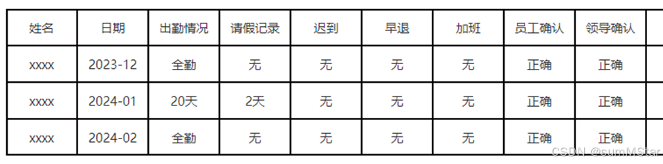
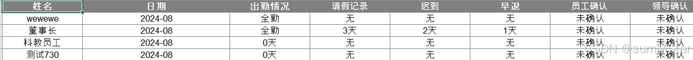

> **參考文章:** [若依导出自定义数据处理器](https://blog.csdn.net/sumMStar/article/details/141158752)

我在编写导出的时候，由于 **若依** 的 `Excel` 注解基本功能不满足我的需求

比如说我想导出这种样式，30和31天导出时全勤，其他天数显示原本天数



遂了解若依自定义数据处理器

# 1.首先来到实体类

> 给注解加上 `handler` 和 `args`

```java
/** 出勤情况 */
@Excel(name = "出勤情况", sort = 3, handler = AttendanceHandlerAdapter.class, args = {"全勤"})
private Long attendanceDay;
```

# 2.来到我们自己编写并实现的类

```java
/**
 * 自定义导出Excel数据格式   全勤
 */
public class AttendanceHandlerAdapter implements  ExcelHandlerAdapter{
    @Override
    public Object format(Object value, String[] args) {
        Long cellValue = (Long) value;
        if (cellValue.equals(30L) || cellValue.equals(31L)) {
            return args[0];
        }
        return value + "天";
    }
}
```

### 形参的意义

```text
/**
 * 格式化
 * 
 * @param value 单元格数据值		实体类字段内值
 * @param args excel注解args参数组	用于传参的数组，可不用
 *
 * @return 处理后的值  也就是导出的Excel的值
 */
```

# 3.然后我们导出结果成功

