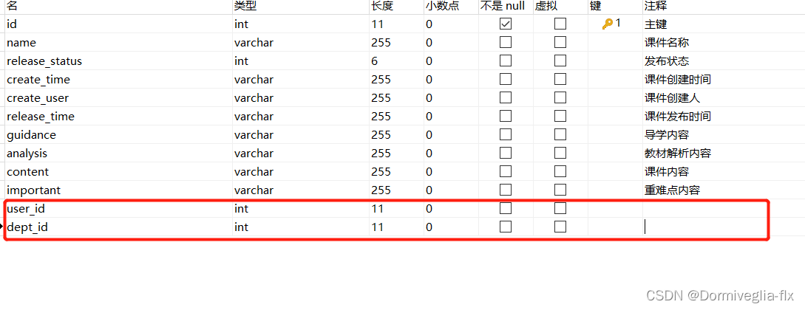
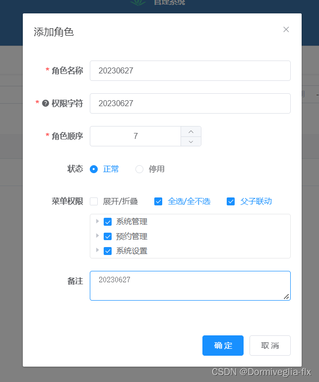
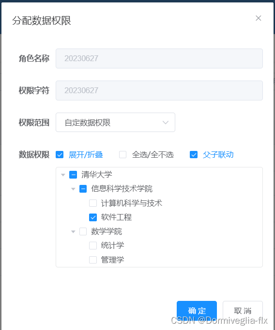
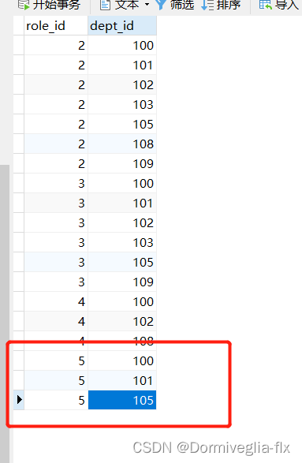
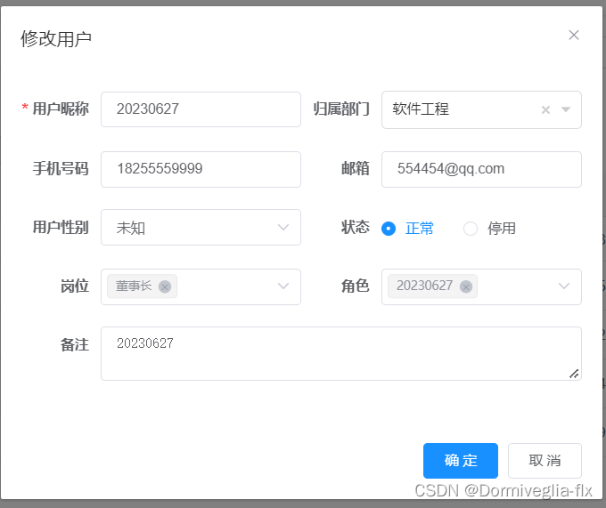
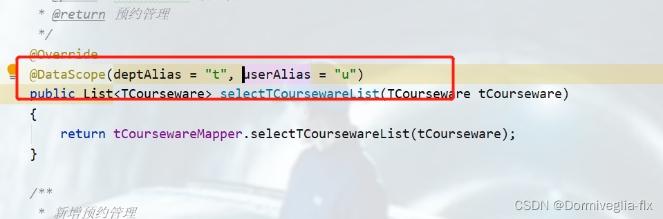
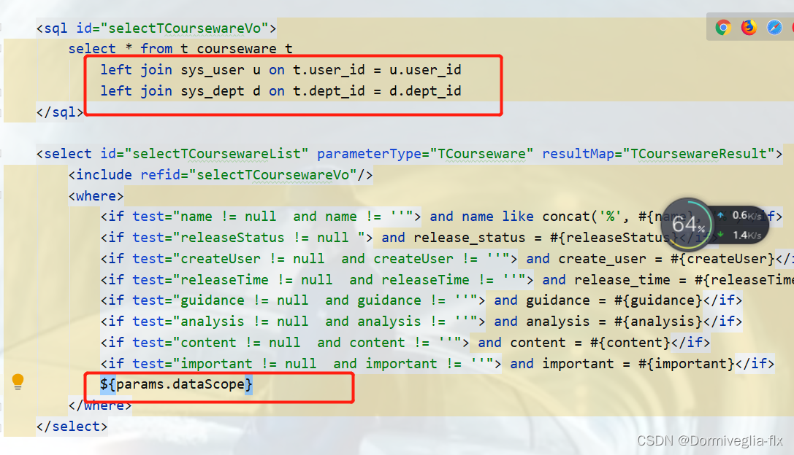
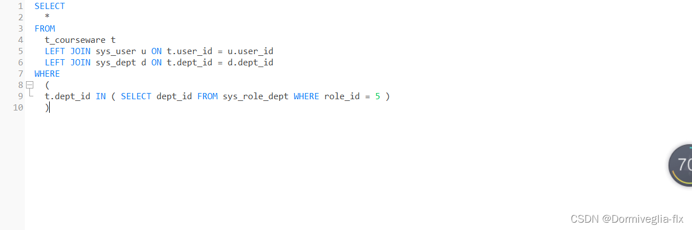
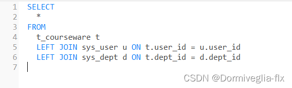
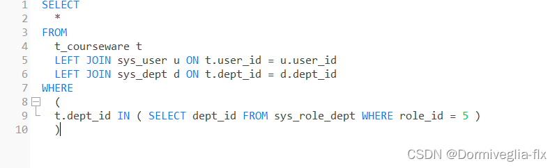

> **參考文章:**
> 
> - [若依ruoyi数据权限详解](https://blog.csdn.net/sugerfle/article/details/131407753)
> - [若依 数据权限图文详细理解及改造](https://blog.csdn.net/weixin_46573158/article/details/128147561)

# 什么是数据权限？

简单的例子就是：

比如一张商品表goods，很多人添加数据，销售部的就可以看到这个数据，生产部的就看不到这个数据。

或者很多工厂向库存表添加数据，A工厂看A工厂的，B工厂也看自己的。

> 本质上说，是一种过滤的过程。我们查到了所有的商品表的信息，然后过滤出我们想要的。我们查到了所有库存表的信息，A工厂看A的，B工厂看B的。

# 若依使用数据权限的步骤：

1. 向需要有数据权限的表中添加 user_id 和 dept_id



2. 添加角色



3. 给角色分配部门的数据权限



这个过程，就是向 `sys_role_dept`表添加数据的过程



4. 新增用户，选择“软件工程”部门，并分配20230627的角色



5. 向业务层加此注解 @DataScope(deptAlias = “t”, userAlias = “u”)



6. 添加左连接和params参数，这个时候名字不要错了



7. 这个时候，就会过滤了。过滤的原理在查出所有数据的基础上，筛选出对应部门的数据



其实本质上就是后面那句话的过滤：

```sql
t.dept_id IN ( SELECT dept_id FROM sys_role_dept WHERE role_id = 5 )
```

原本的sql应该是：



现在多了个条件



这就是数据权限

# 数据权限的原理

- 需要设置数据权限的表，添加 user_id 和 dept_id 用于过滤数据

- 添加角色，分配数据权限的时候，会向 sys_role_dept 中插入数据

- 新建用户，给用户分配部门与角色。目的是用户向需要添加数据权限的表(比如现在的这张表t_courseware)中插入数据的时候，添加上user_id 和 dept_id，以及分配权限。

- 加上注解就是为了拼上sql。通过 t.dept_id IN ( SELECT dept_id FROM sys_role_dept WHERE role_id = 5 ) 实现数据权限。