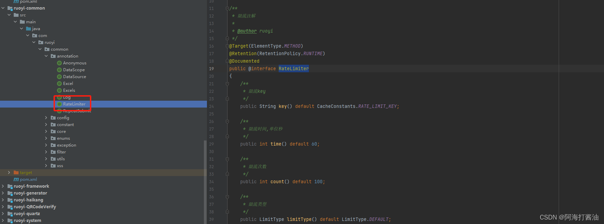
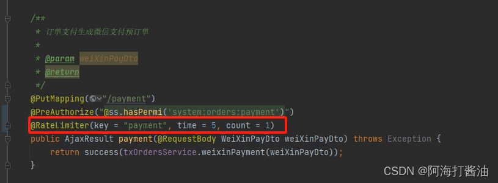
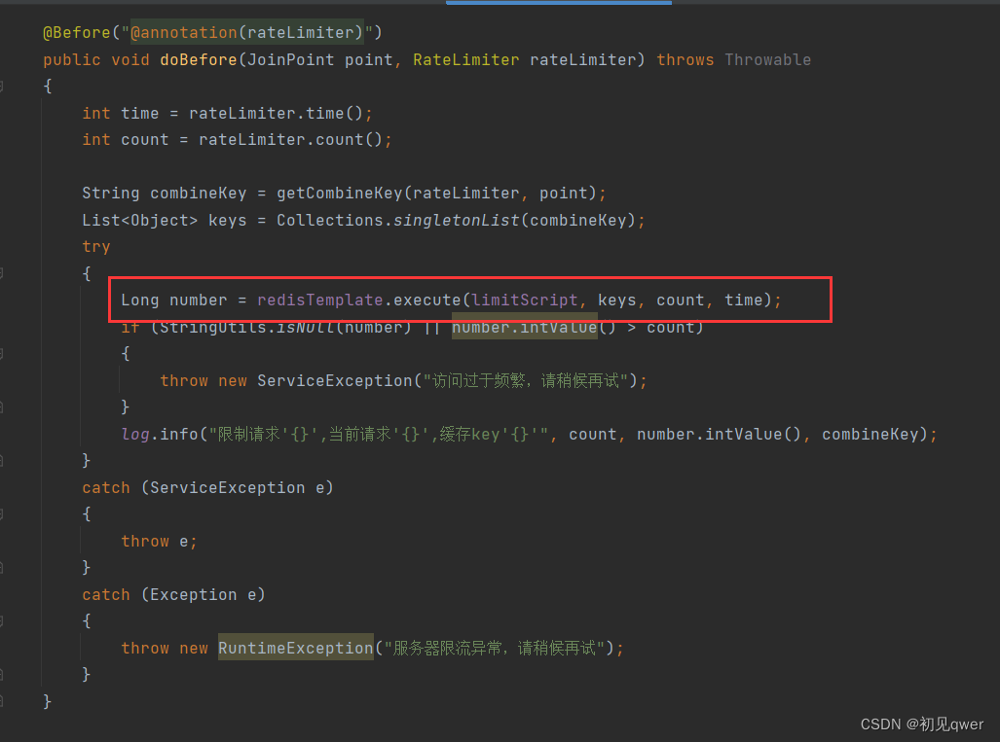
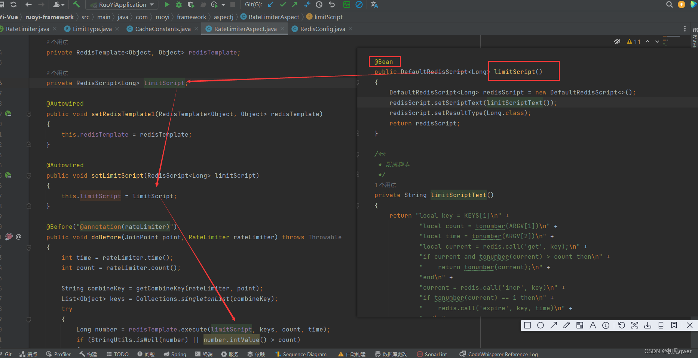
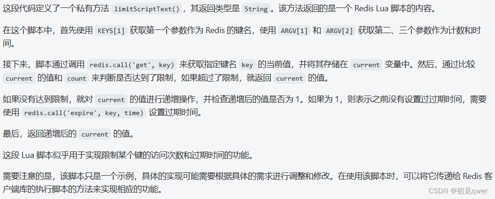

> **參考文章：**
> 
> - [RuoYi-Vue分离版——限流](https://blog.csdn.net/m0_57385405/article/details/135058758)
> - [若依——限流（rateLimiter）（lua脚本与令牌桶）](https://blog.csdn.net/m0_67290880/article/details/131407222)
> - [若依-限流注解@RateLimiter](https://blog.csdn.net/XINLOVEBO/article/details/142392392)

# 限流策略的背景

在开发各种项目时，我们常常需要思考如何应对被自动化脚本或爬虫程序频繁请求而导致服务器资源过载的情况。
为了应对这种情况，我们通常需要采用限流策略。然而，现有的限流方案可能存在一些问题，如灵活性较低、不易复用等。
那么，有没有一种灵活性较高且可复用的方案呢？答案是肯定的，这里介绍若依框架中的 `@RateLimiter` 注解限流策略。
通过在方法上添加 `@RateLimiter` 注解，我们可以灵活地定义限流规则，并且这种限流策略可以被多个方法复用。
这个 `@RateLimiter` 注解可以根据需要设置不同的限流策略，如基于IP的限流、基于并发数的限流，从而对请求进行限制，保护服务器资源的稳定运行。
使用若依框架的 `@RateLimiter` 注解，可以方便地实现灵活且可复用的限流策略，从而有效应对频繁请求导致的服务器资源过载问题。

# 若依框架中的限流方式

若依框架中自定义了一个限流注解 `@RateLimiter`

- key(): 限流的key，默认值为 CacheConstants.RATE_LIMIT_KEY。可以用来标识不同的限流规则。

- time(): 限流的时间，单位为秒，默认值为60。表示在指定时间内进行限流计算。

- count(): 限流次数，默认值为100。表示在指定时间内允许通过的请求次数。

- limitType(): 限流类型，默认值为 LimitType.DEFAULT。用于指定限流的策略，例如默认策略、IP策略等

key可以是接口的指定路径，也可以是总的路径；后面是每五秒只能访问一次（根据自己的业务定义）

# DefaultRedisScript

> 在若依系統中，利用 Lua 腳本實現限流功能，通過 bean 託管來使用 limitScript。

注意这里进行了 `bean` 的托管，因此我们才能使用 `limitScript`

关于 **lua脚本** 的解释

