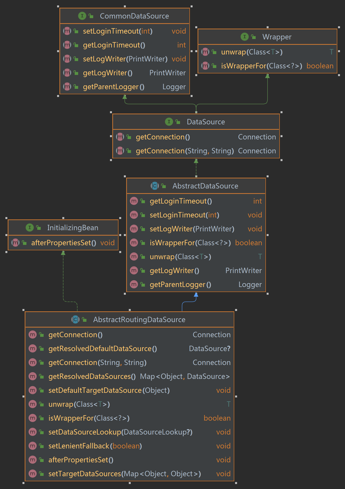

> **參考文章：**
> - [浅析spring中的多数据源解决方案AbstractRoutingDataSource的使用](https://blog.csdn.net/Remember_Z/article/details/124432280)

浅析 `spring` 中的多数据源解决方案 `AbstractRoutingDataSource` 的使用

`AbstractRoutingDataSource` 是 `spring` 提供的一种多数据源解决方案，其继承关系如下图所示。



上图中没有将一些属性展示出来，这里挑几个重点的属性简单分析一下。

```java
private Map<Object, Object> targetDataSources;
private Object defaultTargetDataSource;
private boolean lenientFallback = true;
private DataSourceLookup dataSourceLookup = new JndiDataSourceLookup();
private Map<Object, DataSource> resolvedDataSources;
private DataSource resolvedDefaultDataSource;
```

`targetDataSources` 就是需要设置的多数据源，可理解为从数据源，对应的 `defaultTargetDataSource`可理解为主数据源， 这两个属性均可通过对应的 `setter` 进行设置。
`lenientFallback` 直接翻译有点怪怪的，简单理解，当通过路由查找键找不到对应的数据源时，是否使用默认的数据源，默认是 `true`。
至于后面两个 `resolvedXXX`，其实对应的就是 `targetDataSources` 和 `defaultTargetDataSource`，具体的初始化过程见 `afterPropertiesSet()`，
因为在通过 `setter` 设置数据源的时候，值类型不一定是 `DataSource`，可能为字符串，这时候就需要 `dataSourceLookup` 将其转换为 `DataSource`，`dataSourceLookup` 一般情况下不需要我们自定义，直接使用默认的就行。

当需要操作数据库的时候，`AbstractRoutingDataSource` 通过 `getConnection()` 方法获取当前需要操作的数据源的连接

```java
@Override
public Connection getConnection() throws SQLException {
    return determineTargetDataSource().getConnection();
}
```

具体要使用哪个数据源，则由 `determineTargetDataSource()` 来决定

```java
protected DataSource determineTargetDataSource() {
    Assert.notNull(this.resolvedDataSources, "DataSource router not initialized");
    // 这行是重点，决定当前的查找建，这个键需要与resolvedDataSources中的key对应
    Object lookupKey = determineCurrentLookupKey();
    DataSource dataSource = this.resolvedDataSources.get(lookupKey);
    if (dataSource == null && (this.lenientFallback || lookupKey == null)) {
        // 使用默认数据源
        dataSource = this.resolvedDefaultDataSource;
    }
    if (dataSource == null) {
        throw new IllegalStateException("Cannot determine target DataSource for lookup key [" + lookupKey + "]");
    }
    return dataSource;
}
```

其中，`determineCurrentLookupKey()` 是个抽象方法

```java
protected abstract Object determineCurrentLookupKey();
```

看到这里，大致的使用方式已经基本上很清晰了，接下来就来实现它