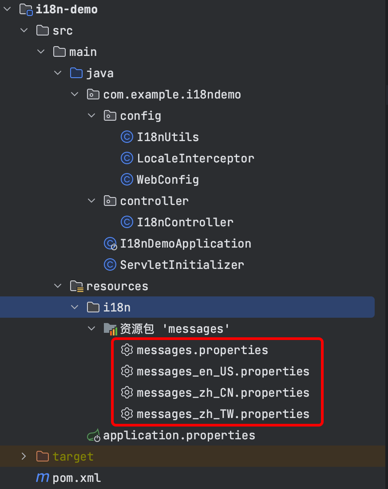

> **參考文章：**
> - [Spring Boot 国际化 i18n](https://blog.csdn.net/qq_28883885/article/details/133746512 "Spring Boot 国际化 i18n")

# 1. 简介
什么是国际化？国际化就是让您的应用系统适配不同的国家和语言，在中国就是中文，在中国台湾就自动切换为繁体中文，在美国就切换成英语。

i18n 是国际化 `internationalization` 这个单词的缩写，取了首字母i和结尾字母n，中间有 18 个字母，相同的命名方式有 k8s。

# 2. Spring Boot 国际化



## 2.1 application.properties

```properties
server.port=8960
spring.application.name=i18n-demo
# 国际化配置文件目录
spring.messages.basename=i18n/messages
```

- `i18n` 是存放目录

- `messages` 是文件前缀

## 2.2 国际化配置文件
在 `resources` 目录下创建 `i18n` 文件夹，然后在 `i18n` 目录下创建如下文件：

- messages.properties 默认语言

- messages_en_US.properties 英文语言

- messages_zh_CN.properties 简体中文

- messages_zh_TW.properties 繁体中文

### 2.2.1 messages.properties
```properties
opr_success=Operation successful
opr_fail=Operation failed
msg_welcome=welcome,{0}!
```

- 可以通过 `{0}` 传递参数。

### 2.2.2 messages_en_US.properties
```properties
# English
opr_success=Operation successful
opr_fail=Operation failed
msg_welcome=welcome,{0}!
```

### 2.2.3 messages_zh_CN.properties
```properties
# 简体中文
opr_success=操作成功
opr_fail=操作失败
msg_welcome=欢迎,{0}!
```

### 2.2.4 messages_zh_TW.properties
```properties
# 繁體中文
opr_success=操作成功
opr_fail=操作失敗
msg_welcome=歡迎,{0}!
```

## 2.3 简单使用
`MessageSource` 的 `getMessage` 方法，传入不同的 `Locale` 就调用不同的语言。

如 `messageSource.getMessage("opr_success", null, Locale.SIMPLIFIED_CHINESE);`。

并且可以创建一个数组如 `new String[]{name}` 来传递参数，对应配置中的 `{0}`。

```java
@RestController
@RequestMapping("i18n")
public class I18nController {
    @Autowired
    private MessageSource messageSource;

    @GetMapping("success")
    public String success() {
        return messageSource.getMessage("opr_success", null, Locale.SIMPLIFIED_CHINESE);
    }

    @GetMapping("fail")
    public String fail() {
        return messageSource.getMessage("opr_fail", null, Locale.US);
    }

    @GetMapping("test")
    public String test(@RequestParam String name) {
        return messageSource.getMessage("msg_welcome", new String[]{name}, Locale.TRADITIONAL_CHINESE);
    }
}
```

# 3. 优雅的使用
## 3.1 LocaleInterceptor

定义一个拦截器：前端通过参数 `lang` 传入语言类型，如 `zh_CN`，根据传入的参数生成对应的 `Locale` 对象，并通过 `LocaleContextHolder.setLocale(locale)` 将 `Locale` 对象放入上下文对象中。

```java
public class LocaleInterceptor implements HandlerInterceptor {

    @Override
    public boolean preHandle(HttpServletRequest request, HttpServletResponse response, Object handler) {
        String lang = request.getParameter("lang");
        Locale locale = Locale.SIMPLIFIED_CHINESE;

        if (lang != null && !lang.trim().isEmpty()) {
            String[] langParts = lang.split("_");
            if (langParts.length == 2) {
                locale = new Locale(langParts[0], langParts[1]);
            }
        }

        LocaleContextHolder.setLocale(locale);

        return true;
    }

    @Override
    public void afterCompletion(HttpServletRequest request, HttpServletResponse response, Object handler, Exception ex) {
        LocaleContextHolder.resetLocaleContext();
    }
}
```

## 3.2 WebConfig

```java
@Configuration
public class WebConfig implements WebMvcConfigurer {

    @Override
    public void addInterceptors(InterceptorRegistry registry) {
        registry.addInterceptor(new LocaleInterceptor());
    }
}
```

## 3.3 I18nUtils

封装 `I18nUtils` 类，提供 `getMessage` 方法获取语言文字，通过 `LocaleContextHolder.getLocale()` 从上下文中获取 `Locale` 对象。

```java
@Component
public class I18nUtils {
    private static MessageSource messageSource;

    @Autowired
    public I18nUtils(MessageSource messageSource) {
        I18nUtils.messageSource = messageSource;
    }

    public static String getMessage(String key) {
        return getMessage(key, null);
    }

    public static String getMessage(String key, Object[] args) {
        Locale locale = LocaleContextHolder.getLocale();
        return messageSource.getMessage(key, args, locale);
    }
}
```

## 3.4 I18nController
```java
@RestController
@RequestMapping("i18n")
public class I18nController {
    @GetMapping("welcome")
    public String welcome(@RequestParam String name) {
        return I18nUtils.getMessage("msg_welcome", new String[]{name});
    }
}
```

# 4. 接口测试
## 4.1 中文

http://localhost:8960/i18n/success

```shell
操作成功
```

## 4.2 英文

http://localhost:8960/i18n/fail

```shell
Operation failed
```

## 4.3 传入参数

http://localhost:8960/i18n/test?name=%E5%BC%A0%E4%B8%89

```shell
歡迎,张三!
```

## 4.4 lang=zh_TW指定语言

http://localhost:8960/i18n/welcome?name=%E5%BC%A0%E4%B8%89&lang=zh_TW

```shell
歡迎,张三!
```

## 4.5 默认的语言

http://localhost:8960/i18n/welcome?name=%E5%BC%A0%E4%B8%89

```shell
欢迎,张三!
```

# 5. 总结
建议在系统早期考虑国际化，即使目前只面向中文用户。

尽早进行国际化设计能够避免后续需要适配其它语言（如英语、繁体中文）时带来的麻烦。

您可以先实现一个默认的中文版本，这样不会给后续工作增加太多负担。

记住，提前考虑国际化能够增加系统的可扩展性和适应性，为未来可能的需求做好准备。