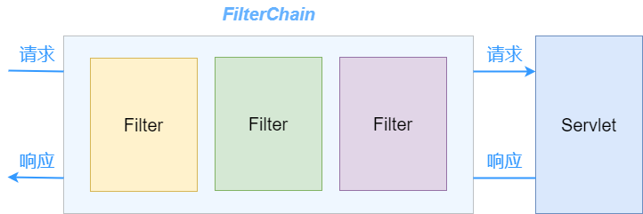

> **參考文章：**
> - [SpringBoot实现过滤器Filter的三种方式](https://blog.csdn.net/huanby/article/details/124708492 "SpringBoot实现过滤器Filter的三种方式")
> - [spring boot过滤器FilterRegistrationBean](https://www.cnblogs.com/ceshi2016/p/13234082.html "spring boot过滤器FilterRegistrationBean")

# 过滤器Filter
过滤器 Filter 由 Servlet 提供，基于函数回调实现链式对网络请求与响应的拦截与修改。

由于基于 Servlet ，其可以对 web 服务器管理的几乎所有资源进行拦截（JSP、图片文件、HTML 文件、CSS文件等）。

定义一个过滤器，需要实现 javax.servlet.Filter 接口。

Filter 并不是一个 Servlet，它不能直接向客户端生成响应，只是拦截已有的请求，对不需要或不符合的信息资源进行预处理。

过滤器可以定义多个，按照过滤器链顺序调用：



# Filter 的生命周期
- init()： 初始化 Filter 实例，Filter 的生命周期与 Servlet 是相同的，也就是当 Web 容器（tomcat）启动时，调用 `init()` 方法初始化实例，Filter 只会初始化一次。需要设置初始化参数的时候，可以写到 `init()` 方法中。

- doFilter()： 业务处理，拦截要执行的请求，对请求和响应进行处理，一般需要处理的业务操作都在这个方法中实现

- destroy() ： 销毁实例，关闭容器时调用 `destroy()` 销毁 Filter 的实例。

# 过滤器的使用方式

首先要实现 javax.servlet.Filter 接口，之后将 Filter 声明为 Bean 交由 Spring 容器管理。

以 SpringBoot 为示例：

使用 `@Configuration` + `@Bean` 配置类，注解声明 Bean，交由 Spring 容器管理。

Java Config 的方式可以通过 `@Bean` 配置顺序或 `FilterRegistrationBean.setOrder()` 决定 Filter 执行顺序。

```java
public class WebVisitFilter implements Filter {
    
    @Override
    public void init(FilterConfig filterConfig) throws ServletException {
    }
    
    @Override
    public void doFilter(ServletRequest request, ServletResponse response, FilterChain chain) throws ServletException, IOException {
        // 业务处理
    }
    
    @Override
    public void destroy() {
    }
}


@Configuration
public class WebVisitFilterConfig {
    /**
     * 注册 过滤器 Filter
     */
    @Bean
    public FilterRegistrationBean<Filter> webVisitFilterConfigRegistration() {
        //匹配拦截 URL
        String urlPatterns = "/admin/*,/system/*";
        FilterRegistrationBean<Filter> registration = new FilterRegistrationBean<Filter>();
        registration.setDispatcherTypes(DispatcherType.REQUEST);
        registration.setFilter(new WebVisitFilter());
        registration.addUrlPatterns(StringUtils.split(urlPatterns, ","));
        //设置名称
        registration.setName("webVisitFilter");
        //设置过滤器链执行顺序
        registration.setOrder(3);
        //启动标识
        registration.setEnabled(true);
        //添加初始化参数
        registration.addInitParameter("enabel", "true");
        return registration;
    }
}
```

# FilterChain 的作用

过滤器链是一种责任链模式的设计实现，在一个 Filter 处理完成业务后，通过 FilterChain 调用过滤器链中的下一个过滤器。

流程如下：

FilterChain 接口定义了 doFilter 方法

```java
public interface FilterChain {
    
    public void doFilter(ServletRequest request, ServletResponse response)
        throws IOException, ServletException;
    
}
```

ApplicationFilterChain 类实现了 FilterChain 接口，管理所有的 Filter 的执行与调用

```java
public final class ApplicationFilterChain implements FilterChain {
    // 数组存储所有的过滤器链
    private ApplicationFilterConfig[] filters = new ApplicationFilterConfig[0];
    
    // 类中实现 doFilter() 方法 调用 调用 internalDoFilter(req,res) 方法
    public void doFilter(ServletRequest request, ServletResponse response)
        throws IOException, ServletException {
        // ...
        //调用 internalDoFilter
        internalDoFilter(request,response);
    }
}
```

internalDoFilter(req,res) 方法中实现 Filter 调用的具体的操作，如下：

```java
//取得数组中下一个过滤器实例
ApplicationFilterConfig filterConfig = filters[pos++];
Filter filter = filterConfig.getFilter();

// ...

//调用下一个过滤器的 doFilter() 方法
filter.doFilter(request, response, this);
```

通过这种方式完成整个过滤器链的调用执行。

# 常见应用场景
- 登录验证

- 统一编码处理

- 敏感字符过滤

# 过滤器链抛出异常处理方式

在过滤器进行拦截操作时，如发生异常，与业务类相同需要捕获异常进行记录并处理。

如果想继续执行业务，可以通过 chain.doFilter(req, response); 对之后的过滤器进行调用。
