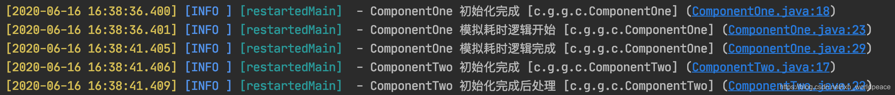

> **參考文章：** [Spring Boot：@PostConstruct虽好，也要慎用](https://blog.csdn.net/lxh_worldpeace/article/details/106789546 "Spring Boot：@PostConstruct虽好，也要慎用")

做过 `SpringBoot` 开发的话，肯定对 `@PostConstruct` 比较熟悉。

在一个 `Bean` 组件中，标记了 `@PostConstruct` 的方法会在 `Bean` 构造完成后自动执行方法的逻辑。

# 1 问题的产生

先说下 `SpringBoot` 中 `Bean` 的加载过程，简单点说就是 `SpringBoot` 会把标记了 `Bean` 相关注解（例如 `@Component`、`@Service`、`@Repository` 等）的类或接口自动初始化全局的单一实例，如果标记了初始化顺序会按照用户标记的顺序，否则按照默认顺序初始化。

在初始化的过程中，执行完一个 `Bean` 的构造方法后会执行该 `Bean` 的 `@PostConstruct` 方法（如果有），然后初始化下一个 `Bean`。

那么： 如果 `@PostConstruct` 方法内的逻辑处理时间较长，就会增加 `SpringBoot` 应用初始化 `Bean` 的时间，进而增加应用启动的时间。

因为只有在 `Bean` 初始化完成后，`SpringBoot` 应用才会打开端口提供服务，所以在此之前，应用不可访问。

# 2 案例模拟

为了模拟上面说的情况，在 `SpringBoot` 项目中建两个组件类 `ComponentOne` 和 `ComponentTwo`。

耗时的初始化逻辑放在 `ComponentOne` 中，并设置 `ComponentOne` 的初始化顺序在 `ComponentTwo` 之前。

完整代码如下：

```java
@Component
@Order(Ordered.HIGHEST_PRECEDENCE)
public class ComponentOne {
    private Logger logger = LoggerFactory.getLogger(this.getClass());

    public ComponentOne() {
        this.logger.info("ComponentOne 初始化完成");
    }

    @PostConstruct
    public void init() {
        this.logger.info("ComponentOne 模拟耗时逻辑开始");
        try {
        	//这里休眠5秒模拟耗时逻辑
            Thread.sleep(1000 * 5);
        } catch (InterruptedException e) {
            logger.info("模拟逻辑耗时失败", e);
        }
        this.logger.info("ComponentOne 模拟耗时逻辑完成");
    }
}
```

```java

@Component
@Order(Ordered.HIGHEST_PRECEDENCE + 1)
public class ComponentTwo {
    private Logger logger = LoggerFactory.getLogger(this.getClass());

    public ComponentTwo() {
        this.logger.info("ComponentTwo 初始化完成");
    }

    @PostConstruct
    public void init() {
        this.logger.info("ComponentTwo 初始化完成后处理");
    }
}
```

启动应用，初始化部分日志如下：



# 3 总结

所以，如果应用有一些初始化操作，有以下几点建议：

1. 轻量的逻辑可放在 `Bean` 的 `@PostConstruct` 方法中
2. 耗时长的逻辑如果放在 `@PostConstruct` 方法中，可使用独立线程执行
