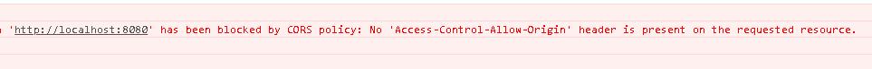

> **參考文章：**
> - [Springboot处理CORS跨域请求的三种方法](https://blog.csdn.net/qq_39390545/article/details/106615075 "Springboot处理CORS跨域请求的三种方法")

# 前言
`Springboot` 跨域问题，是当前主流 `web` 开发人员都绕不开的难题。 但我们首先要明确以下几点

1. 跨域只存在于浏览器端，不存在于安卓、ios、Node.js、python、java 等其它环境。
2. 跨域请求能发出去，服务端能收到请求并正常返回结果，只是结果被浏览器拦截了。
3. 之所以会跨域，是因为受到了同源策略的限制，同源策略要求源相同才能正常进行通信，即协议、域名、端口号都完全一致。

浏览器出于安全的考虑，使用 `XMLHttpRequest` 对象发起 HTTP 请求时必须遵守同源策略，否则就是跨域的 HTTP 请求，默认情况下是被禁止的。

换句话说，浏览器安全的基石是同源策略。

同源策略限制了从同一个源加载的文档或脚本如何与来自另一个源的资源进行交互。这是一个用于隔离潜在恶意文件的重要安全机制。

**先给出一个熟悉的报错信息，让你找到家的感觉~**



```shell
Access to XMLHttpRequest at 'http://192.168.1.1:8080/app/easypoi/importExcelFile' from origin 'http://localhost:8080' has been blocked by CORS policy: No 'Access-Control-Allow-Origin' header is present on the requested resource.
```

# 一、什么是CORS？
`CORS` 是一个 W3C 标准，全称是”跨域资源共享”（Cross-origin resource sharing），允许浏览器向跨源服务器，发出 `XMLHttpRequest` 请求，从而克服了 `AJAX` 只能同源使用的限制。

它通过服务器增加一个特殊的 Header[Access-Control-Allow-Origin] 来告诉客户端跨域的限制，如果浏览器支持 `CORS`、并且判断 `Origin` 通过的话，就会允许 `XMLHttpRequest` 发起跨域请求。

## CORS Header
- Access-Control-Allow-Origin: http://www.xxx.com

- Access-Control-Max-Age：86400

- Access-Control-Allow-Methods：GET, POST, OPTIONS, PUT, DELETE

- Access-Control-Allow-Headers: content-type

- Access-Control-Allow-Credentials: true

## 含义解释：

| CORS | Header属性 | 解释 |
| --- | --- | --- |
| Access-Control-Allow-Origin | 允许http://www.xxx.com域（自行设置，这里只做示例）发起跨域请求 |
| Access-Control-Max-Age | 设置在86400秒不需要再发送预校验请求 |
| Access-Control-Allow-Methods | 设置允许跨域请求的方法 |
| Access-Control-Allow-Headers | 允许跨域请求包含content-type |
| Access-Control-Allow-Credentials | 设置允许Cookie |

# 二、SpringBoot跨域请求处理方式

## 方法一、直接采用 `SpringBoot` 的注解 `@CrossOrigin`（也支持SpringMVC）
简单粗暴的方式，Controller 层在需要跨域的类或者方法上加上该注解即可

```java
@RestController
@CrossOrigin
@RequestMapping("/situation")
public class SituationController extends PublicUtilController {
 
    @Autowired
    private SituationService situationService;
    // log日志信息
    private static Logger LOGGER = Logger.getLogger(SituationController.class);
}
```

但每个 Controller 都得加，太麻烦了，怎么办呢，加在 Controller 公共父类（PublicUtilController）中，所有 Controller 继承即可。

```java
@CrossOrigin
public class PublicUtilController {
 
    /**
     * 公共分页参数整理接口
     *
     * @param currentPage
     * @param pageSize
     * @return
     */
    public PageInfoUtil proccedPageInfo(String currentPage, String pageSize) {
 
        /* 分页 */
        PageInfoUtil pageInfoUtil = new PageInfoUtil();
        try {
            /*
             * 将字符串转换成整数,有风险, 字符串为a,转换不成整数
             */
            pageInfoUtil.setCurrentPage(Integer.valueOf(currentPage));
            pageInfoUtil.setPageSize(Integer.valueOf(pageSize));
        } catch (NumberFormatException e) {
        }
        return pageInfoUtil;
    }
}
```

## 方法二、处理跨域请求的 Configuration
增加一个配置类，`CrossOriginConfig.java`。

继承 `WebMvcConfigurerAdapter` 或者实现 `WebMvcConfigurer` 接口，其他都不用管，项目启动时，会自动读取配置。

```java
@Configuration
public class CorsConfig implements WebMvcConfigurer {
    @Override
    public void addCorsMappings(CorsRegistry registry) {
        registry.addMapping("/**")
                .allowedOrigins("http://localhost")
                .allowedMethods("*")
                .allowedHeaders("*")
                .maxAge(3600);
    }
}
```

## 方法三、采用过滤器（filter）的方式
同方法二加配置类，增加一个 `CORSFilter` 类，并实现 `Filter` 接口即可，其他都不用管，接口调用时，会过滤跨域的拦截。

```java
@Configuration
public class CorsConfig implements WebMvcConfigurer {
    @Bean
    public CorsFilter corsFilter(){
        CorsConfiguration config = new CorsConfiguration();
        config.addAllowedOriginPattern("*");
        config.addAllowedHeader("*");
        config.addAllowedMethod("*");
        config.setMaxAge(1800L);
        UrlBasedCorsConfigurationSource source = new UrlBasedCorsConfigurationSource();
        source.registerCorsConfiguration("/**", config);
        return new CorsFilter(source);
    }
}
```