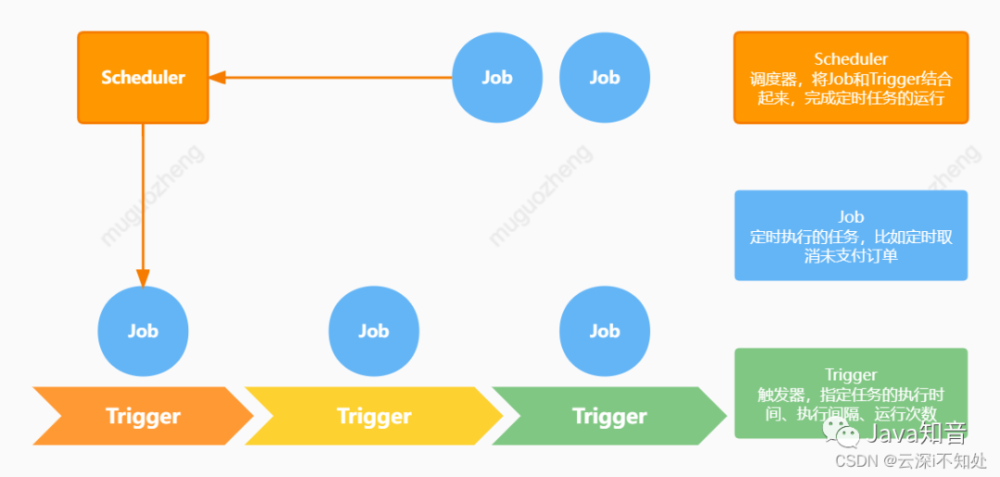
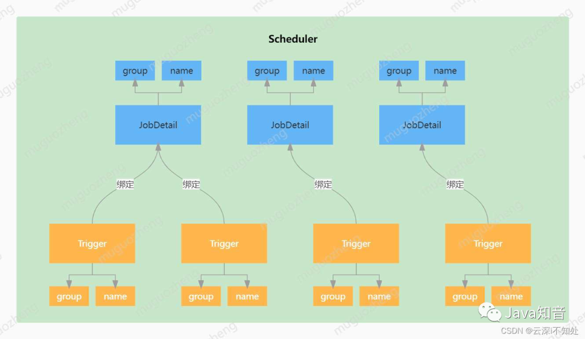
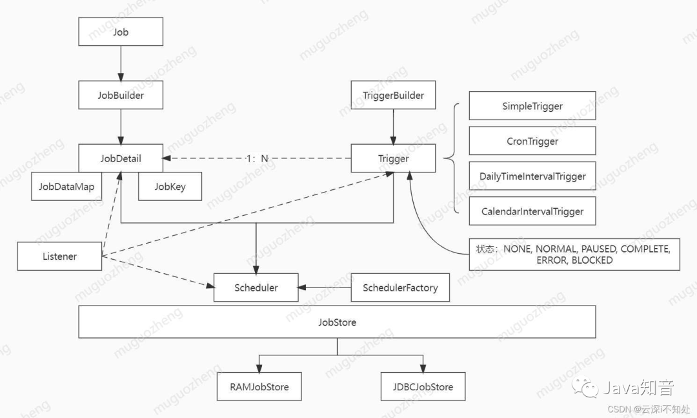
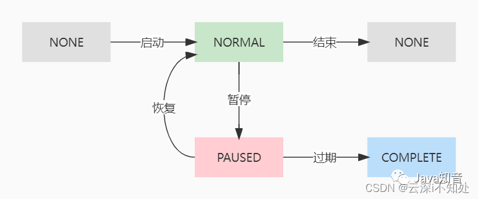

> **參考文章:** [深入Quartz，更优雅地管理你的定时任务](https://www.cnblogs.com/wk-missQ1/p/16658710.html "深入Quartz，更优雅地管理你的定时任务")

在 Java 领域，有很多定时任务框架，这里简单对比一下目前比较流行的三款：


> **网络资源：**
> - Quartz文档：https://www.w3cschool.cn/quartz_doc/
> - xxl-job博客：https://www.cnblogs.com/xuxueli/p/5021979.html

# 1 初识 Quartz

如果你的定时任务没有分布式需求，但需要对任务有一定的动态管理，例如任务的启动、暂停、恢复、停止和触发时间修改，那么 Quartz 非常适合你。

Quartz 是 Java 定时任务领域一个非常优秀的框架，由 OpenSymphony（一个开源组织）开发，这个框架进行了优良地解耦设计，整个模块可以分为三大部分：

- Job：顾名思义，指待定时执行的具体工作内容；
- Trigger：触发器，指定运行参数，包括运行次数、运行开始时间和技术时间、运行时长等；
- Scheduler：调度器，将 Job 和 Trigger 组装起来，使定时任务被真正执行；



下面这个图简略地描述了三者之间的关系：

- 一个 JobDetail（Job的实现类）可以绑定多个 Trigger，但一个 Trigger 只能绑定一个 JobDetail；
- 每个 JobDetail 和 Trigger 通过 group 和 name 来标识唯一性；
- 一个 Scheduler 可以调度多组 JobDetail 和 Trigger。



为了便于理解和记忆，可以把这套设计机制与工厂车间相关联：

- Job：把 Job 比作车间要生产的一类产品，例如汽车、电脑等。
- Trigger：trigger 可以理解为一条生产线，一条生产线只能生产一类产品，但一类产品可以由多条生产线生产。
- Scheduler：Scheduler 则可以理解为车间主任，指挥调度着车间内的生产任务（Scheduler 内置线程池，线程池内的工作线程即为车间工人，每个工人承担着一组任务的真正执行）。

# 2 Quartz 基础使用
Quartz 提供了丰富的 API，下面我们在 Springboot 中使用 Quartz 完成一些简单的 demo。

## 2.1 基于时间间隔的定时任务
基于时间间隔和时间长度实现定时任务，借助 SimpleTrigger，例如这个场景——每隔2s在控制台输出线程名和当前时间，持续 30s。

导入依赖：

```xml
<dependency>
    <groupId>org.springframework.boot</groupId>
    <artifactId>spring-boot-starter-quartz</artifactId>
</dependency>
```

新建Job，实现我们想要定时执行的任务：

```java
import org.quartz.Job;
import org.quartz.JobExecutionContext;
import java.time.LocalDateTime;
import java.time.format.DateTimeFormatter;

public class SimpleJob implements Job {
    @Override
    public void execute(JobExecutionContext jobExecutionContext) {
        // 创建一个事件，下面仅创建一个输出语句作演示
        System.out.println(Thread.currentThread().getName() + "--"
                + DateTimeFormatter.ofPattern("yyyy-MM-dd HH:mm:ss").format(LocalDateTime.now()));
    }
}
```

创建Scheduler和Trigger，执行定时任务：

```java
import com.quartz.demo.schedule.SimpleJob;
import org.junit.jupiter.api.Test;
import org.quartz.*;
import org.quartz.impl.StdSchedulerFactory;

import java.util.Date;
import java.util.concurrent.TimeUnit;

public class SimpleQuartzTest {
    /*
     * 基于时间间隔的定时任务
     */
    @Test
    public void simpleTest() throws SchedulerException, InterruptedException {
        // 1、创建Scheduler（调度器）
        SchedulerFactory schedulerFactory = new StdSchedulerFactory();
        Scheduler scheduler = schedulerFactory.getScheduler();
        // 2、创建JobDetail实例，并与SimpleJob类绑定(Job执行内容)
        JobDetail jobDetail = JobBuilder.newJob(SimpleJob.class)
                .withIdentity("job1", "group1")
                .build();
        // 3、构建Trigger（触发器），定义执行频率和时长
        Trigger trigger = TriggerBuilder.newTrigger()
                // 指定group和name，这是唯一身份标识
                .withIdentity("trigger-1", "trigger-group")
                .startNow()  //立即生效
                .withSchedule(SimpleScheduleBuilder.simpleSchedule()
                        .withIntervalInSeconds(2) //每隔2s执行一次
                        .repeatForever())  // 永久执行
                .build();
        //4、将Job和Trigger交给Scheduler调度
        scheduler.scheduleJob(jobDetail, trigger);
        // 5、启动Scheduler
        scheduler.start();
        // 休眠，决定调度器运行时间，这里设置30s
        TimeUnit.SECONDS.sleep(30);
        // 关闭Scheduler
        scheduler.shutdown();
    }
}
```

启动测试方法后，控制台观察现象即可。

注意到这么一句日志：Using thread pool 'org.quartz.simpl.SimpleThreadPool' - with 10 threads.，这说明 Scheduler 确实是内置了10个线程的线程池，通过打印线程名也印证了这一点。

另外要尤其注意的是，我们之所以通过 `TimeUnit.SECONDS.sleep(30);` 设置休眠，是因为定时任务是交由线程池异步执行的，而测试方法运行结束，主线程随之结束导致定时任务也不再执行了，所以需要设置休眠 `hold` 住主线程。

在真实项目中，项目的进程是一直存活的，因此不需要设置休眠时间。

## 2.2 基于 Cron 表达式的定时任务
基于Cron表达式的定时任务demo如下：

```java
import com.quartz.demo.schedule.SimpleJob;
import org.junit.jupiter.api.Test;
import org.quartz.*;
import org.quartz.impl.StdSchedulerFactory;
import java.util.concurrent.TimeUnit;

public class SimpleQuartzTest {

    /*
     * 基于cron表达式的定时任务
     */
    @Test
    public void cronTest() throws SchedulerException, InterruptedException {
        // 1、创建Scheduler（调度器）
        SchedulerFactory schedulerFactory = new StdSchedulerFactory();
        Scheduler scheduler = schedulerFactory.getScheduler();
        // 2、创建JobDetail实例，并与SimpleJob类绑定
        JobDetail jobDetail = JobBuilder.newJob(SimpleJob.class)
                .withIdentity("job-1", "job-group").build();
        // 3、构建Trigger（触发器），定义执行频率和时长
        CronTrigger cronTrigger = TriggerBuilder.newTrigger()
                .withIdentity("trigger-1", "trigger-group")
                .startNow()  //立即生效
                .withSchedule(CronScheduleBuilder.cronSchedule("* 30 10 ? * 1/5 *"))
                .build();

        //4、执行
        scheduler.scheduleJob(jobDetail, cronTrigger);
        scheduler.start();
        // 休眠，决定调度器运行时间，这里设置30s
        TimeUnit.SECONDS.sleep(30);
        // 关闭Scheduler
        scheduler.shutdown();
    }
}
```

# 3 Quartz 解读
整个 Quartz 体系涉及的类及之间的关系如下图所示：



- JobDetail：Job 接口的实现类，由 JobBuilder 将具体定义任务的类包装而成。

- Trigger：触发器，定义定时任务的触发规则，包括执行间隔、时长等，使用 TriggerBuilder 创建，JobDetail 和 Trigger 可以一对多，反之不可。触发器可以拥有多种状态。

- Scheduler：调度器，将 Job 和 Trigger 组装起来，使定时任务被真正执行；是 Quartz 的核心，提供了大量 API。

- JobDataMap：集成 Map，通过键值对为 JobDetail 存储一些额外信息。

- JobStore：用来存储任务和触发器相关的信息，例如任务名称、数量、状态等等。Quartz 中有两种存储任务的方式，一种在在内存（RAMJobStore），一种是在数据库（JDBCJobStore）。

## 3.1 Job
Job 是一个接口，只有一个方法 execute()，我们创建具体的任务类时要继承 Job 并重写 execute()方法，使用 JobBuilder 将具体任务类包装成一个 JobDetail（使用了建造者模式）交给 Scheduler 管理。

每个 JobDetail 由 name 和 group 作为其唯一身份标识。

- JobDataMap 中可以包含不限量的（序列化的）数据对象，在job实例执行的时候，可以使用其中的数据。
- JobDataMap 继承 Map，可通过键值对为 JobDetail 存储一些额外信息。

## 3.2 Trigger
Trigger 有四类实现，分别如下：

- SimpleTrigger：简单触发器，支持定义任务执行的间隔时间，执行次数的规则有两种，一是定义重复次数，二是定义开始时间和结束时间。如果同时设置了结束时间与重复次数，先结束的会覆盖后结束的，以先结束的为准。

- CronTrigger：基于 Cron 表达式的触发器。

- CalendarIntervalTrigger：基于日历的触发器，比简单触发器更多时间单位，且能智能区分大小月和平闰年。

- DailyTimeIntervalTrigger：基于日期的触发器，如每天的某个时间段。

Trigger 是有状态的：NONE, NORMAL, PAUSED, COMPLETE, ERROR, BLOCKED，状态之间转换关系：



COMPLETE 状态比较特殊，我在实际操作中发现，当 Trigger 长时间暂停后（具体时长不太确定）再恢复，状态就会变为 COMPLETE，这种状态下无法再次启动该触发器。

## 3.3 Scheduler
调度器，是 Quartz 的指挥官，由 StdSchedulerFactory 产生，它是单例的。

Scheduler 中提供了 Quartz 中最重要的 API，默认是实现类是 StdScheduler。

Scheduler 中主要的 API 大概分为三种：

- 操作 Scheduler 本身：例如 start、shutdown 等；
- 操作 Job：例如：addJob、pauseJob、pauseJobs、resumeJob、resumeJobs、getJobKeys、getJobDetail 等
- 操作 Trigger：例如 pauseTrigger、resumeTrigger 等

> 这些API使用非常简单，源码中也有完善的注释，这里不再赘述。

# 4 Quartz 进阶使用
除了基本使用外，Quartz 还有一些较为复杂的应用场景。

## 4.1 多触发器的定时任务
前文提过，一个 JobDetail 可以绑定多个触发器，这种场景还是有一些注意点的：

- 首先，要通过 storeDurably() 方法将 JobDetail 设置为孤立后保存存储（没有触发器指向该作业的情况）；

- Scheduler 通过 addJob()将给定的作业添加到计划程序中-没有关联的触发器。作业将处于“休眠”状态，直到使用触发器或调度程序对其进行调度；

- 触发器通过 forJob(JobDetail jobDetail)指定要绑定的 JobDetail，scheduleJob()方法只传入触发器，触发后将自动执行 addJob 过的绑定 JobDetail。

```java
import com.quartz.demo.schedule.SimpleJob;
import org.junit.jupiter.api.Test;
import org.quartz.*;
import org.quartz.impl.StdSchedulerFactory;
import java.util.concurrent.TimeUnit;

public class MultiQuartzTest {

    @Test
    public void multiJobTest() throws SchedulerException, InterruptedException {
        // 1、创建Scheduler（调度器）
        SchedulerFactory schedulerFactory = new StdSchedulerFactory();
        Scheduler scheduler = schedulerFactory.getScheduler();
        // 2、创建JobDetail实例，与执行内容类SimpleJob绑定，注意要设置 .storeDurably()，否则报错
        JobDetail jobDetail = JobBuilder.newJob(SimpleJob.class)
                .withIdentity("job1", "job-group")
                .storeDurably()
                .build();

        // 3、分别构建Trigger实例
        Trigger trigger = TriggerBuilder.newTrigger().withIdentity("trigger1", "trigger-group")
                .startNow()//立即生效
                .forJob(jobDetail)
                .withSchedule(SimpleScheduleBuilder
                        .simpleSchedule()
                        .withIntervalInSeconds(2) //每隔3s执行一次
                        .repeatForever()) // 永久循环
                .build();
        Trigger trigger2 = TriggerBuilder.newTrigger().withIdentity("trigger2", "trigger-group")
                .startNow()//立即生效
                .forJob(jobDetail)
                .withSchedule(SimpleScheduleBuilder.simpleSchedule()
                        .withIntervalInSeconds(3) //每隔5s执行一次
                        .repeatForever()).build(); // 永久循环
        //4、调度器中添加job
        scheduler.addJob(jobDetail, false);
        scheduler.scheduleJob(trigger);
        scheduler.scheduleJob(trigger2);
        // 启动调度器
        scheduler.start();
        // 休眠任务执行时长
        TimeUnit.SECONDS.sleep(20);
        scheduler.shutdown();
    }
}
```

## 4.2 Job 中注入 Bean
有时候，我们要在定时任务中操作数据库，但 Job 中无法直接注入数据层，解决这种问题，有两种解决方案。

### 方案一：借助 JobDataMap
在构建 JobDetail 时，可以将数据放入 JobDataMap，基本类型的数据通过 usingJobData 方法直接放入，mapper 这种类型数据手动 put 进去：

```java
@Autowired
private PersonMapper personMapper;

// 构建定时任务
JobDetail jobDetail = JobBuilder.newJob(MajorJob.class)
        .withIdentity(jobName, jobGroupName)
        .usingJobData("jobName", "QuartzDemo")
        .build();
		
// 将mapper放入jobDetail的jobDataMap中
jobDetail.getJobDataMap().put("personMapper", personMapper);
```

在 job 的执行过程中，可以从 JobDataMap 中取出数据，如下示例：

```java
import com.quartz.demo.entity.Person;
import com.quartz.demo.mapper.PersonMapper;
import org.quartz.Job;
import org.quartz.JobDataMap;
import org.quartz.JobExecutionContext;

import java.time.LocalDateTime;
import java.time.format.DateTimeFormatter;
import java.util.List;

public class MajorJob implements Job {
    @Override
    public void execute(JobExecutionContext jobExecutionContext) {
        JobDataMap dataMap = jobExecutionContext.getJobDetail().getJobDataMap();
        String jobName = dataMap.getString("jobName");
        PersonMapper personMapper = (PersonMapper) dataMap.get("personMapper");
        // 这样就可以执行mapper层方法了
        List<Person> personList = personMapper.queryList();

        System.out.println(Thread.currentThread().getName() + "--"
                + DateTimeFormatter.ofPattern("yyyy-MM-dd HH:mm:ss").format(LocalDateTime.now()) + "--"
                + jobName + "--" + personList);
    }
}
```

这个方案相对简单，但在持久化中会遇到 mapper 的序列化问题：

```shell
java.io.NotSerializableException: Unable to serialize JobDataMap for insertion into database because the value of property 'personMapper' is not serializable: org.mybatis.spring.SqlSessionTemplate
```

### 方案二：静态工具类
创建工具类 SpringContextJobUtil，实现 ApplicationContextAware 接口

```java
import org.springframework.beans.BeansException;
import org.springframework.context.ApplicationContext;
import org.springframework.context.ApplicationContextAware;
import org.springframework.stereotype.Component;

import java.util.Locale;

@Component
public class SpringContextJobUtil implements ApplicationContextAware {
    private static ApplicationContext context;

    @Override
    @SuppressWarnings("static-access")
    public void setApplicationContext(ApplicationContext contex) throws BeansException {
        this.context = contex;
    }

    /**
     * 根据name获取bean
     *
     * @param beanName name
     * @return bean对象
     */
    public static Object getBean(String beanName) {
        return context.getBean(beanName);
    }

    public static String getMessage(String key) {
        return context.getMessage(key, null, Locale.getDefault());
    }
}
```

mapper 类上打上 @Service 注解，并赋予其 name：

```java
@Service("personMapper")
public interface PersonMapper {
    @Select("select id,name,age,sex,address,sect,skill,power,create_time createTime,modify_time modifyTime from mytest.persons")
    List<Person> queryList();
}
```

Job 中通过 SpringContextJobUtil 的 getBean 获取 mapper 的 bean：

```java
public class MajorJob implements Job {
    @Override
    public void execute(JobExecutionContext jobExecutionContext) {
        JobDataMap dataMap = jobExecutionContext.getJobDetail().getJobDataMap();
        String jobName = dataMap.getString("jobName");

        PersonMapper personMapper = (PersonMapper) SpringContextJobUtil.getBean("personMapper");
        List<Person> personList = personMapper.queryList();

        System.out.println(Thread.currentThread().getName() + "--"
                + DateTimeFormatter.ofPattern("yyyy-MM-dd HH:mm:ss").format(LocalDateTime.now()) + "--"
                + jobName + "--" + personList);
    }
}
```

> 推荐使用这个方法。

## 4.3 Quartz 的持久化
定时任务的诸多要素，如任务名称、数量、状态、运行频率、运行时间等，是要存储起来的。

JobStore，就是用来存储任务和触发器相关的信息的。

Quartz 中有两种存储任务的方式，一种在在内存（RAMJobStore），一种是在数据库（JDBCJobStore）。

Quartz 默认的 JobStore 是 RAMJobstore，也就是把任务和触发器信息运行的信息存储在内存中，用到了 HashMap、TreeSet、HashSet 等等数据结构，如果程序崩溃或重启，所有存储在内存中的数据都会丢失。所以我们需要把这些数据持久化到磁盘。扩展：最全的java面试题库

实现Quartz的持久化并不困难，按下列步骤操作即可：

添加相关依赖：

```xml
<!--Quartz 使用的连接池 -->
<dependency>
    <groupId>com.mchange</groupId>
    <artifactId>c3p0</artifactId>
    <version>0.9.5.2</version>
</dependency>
```

编写配置：

```java
import org.quartz.Scheduler;
import org.quartz.ee.servlet.QuartzInitializerListener;
import org.springframework.beans.factory.config.PropertiesFactoryBean;
import org.springframework.context.annotation.Bean;
import org.springframework.context.annotation.Configuration;
import org.springframework.core.io.ClassPathResource;
import org.springframework.scheduling.quartz.SchedulerFactoryBean;

import java.io.IOException;
import java.util.Properties;

/**
 * @author muguozheng
 * @version 1.0.0
 * @createTime 2022/4/19 18:46
 * @description Quartz配置
 */
@Configuration
public class SchedulerConfig {
    /**
     * 读取quartz.properties,将值初始化
     *
     * @return Properties
     * @throws IOException io
     */
    @Bean
    public Properties quartzProperties() throws IOException {
        PropertiesFactoryBean propertiesFactoryBean = new PropertiesFactoryBean();
        propertiesFactoryBean.setLocation(new ClassPathResource("/quartz.properties"));
        propertiesFactoryBean.afterPropertiesSet();
        return propertiesFactoryBean.getObject();
    }

    /**
     * 将配置文件的数据加载到SchedulerFactoryBean中
     *
     * @return SchedulerFactoryBean
     * @throws IOException io
     */
    @Bean
    public SchedulerFactoryBean schedulerFactoryBean() throws IOException {
        SchedulerFactoryBean schedulerFactoryBean = new SchedulerFactoryBean();
        schedulerFactoryBean.setQuartzProperties(quartzProperties());
        return schedulerFactoryBean;
    }

    /**
     * 初始化监听器
     *
     * @return QuartzInitializerListener
     */
    @Bean
    public QuartzInitializerListener executorListener() {
        return new QuartzInitializerListener();
    }

    /**
     * 获得Scheduler对象
     *
     * @return Scheduler
     * @throws IOException io
     */
    @Bean
    public Scheduler scheduler() throws IOException {
        return schedulerFactoryBean().getScheduler();
    }
}
```

创建 quartz.properties 配置文件

```properties
# 实例化ThreadPool时，使用的线程类为SimpleThreadPool
org.quartz.threadPool.class=org.quartz.simpl.SimpleThreadPool
# 并发个数
org.quartz.threadPool.threadCount=10
# 优先级
org.quartz.threadPool.threadPriority=3
org.quartz.threadPool.threadsInheritContextClassLoaderOfInitializingThread=true
org.quartz.jobStore.misfireThreshold=5000
# 持久化使用的类
org.quartz.jobStore.class=org.quartz.impl.jdbcjobstore.JobStoreTX
# 数据库中表的前缀
org.quartz.jobStore.tablePrefix=QRTZ_
# 数据源命名
org.quartz.jobStore.dataSource=qzDS
# qzDS 数据源
org.quartz.dataSource.qzDS.driver=com.mysql.jdbc.Driver
org.quartz.dataSource.qzDS.URL=jdbc:mysql://localhost:3306/mytest?useUnicode=true&characterEncoding=UTF-8
org.quartz.dataSource.qzDS.user=root
org.quartz.dataSource.qzDS.password=root
org.quartz.dataSource.qzDS.maxConnections=10
```

创建 Quartz 持久化数据的表

数据表初始化 sql 放置在 External Libraries 的 org/quartz/impl/jdbcjobstore 中，直接用其初始化相关表即可。

要注意的是，用来放置这些表的库要与 quartz.properties 的库一致。

```sql
#
# Quartz seems to work best with the driver mm.mysql-2.0.7-bin.jar
#
# PLEASE consider using mysql with innodb tables to avoid locking issues
#
# In your Quartz properties file, you'll need to set
# org.quartz.jobStore.driverDelegateClass = org.quartz.impl.jdbcjobstore.StdJDBCDelegate
#

DROP TABLE IF EXISTS QRTZ_FIRED_TRIGGERS;
DROP TABLE IF EXISTS QRTZ_PAUSED_TRIGGER_GRPS;
DROP TABLE IF EXISTS QRTZ_SCHEDULER_STATE;
DROP TABLE IF EXISTS QRTZ_LOCKS;
DROP TABLE IF EXISTS QRTZ_SIMPLE_TRIGGERS;
DROP TABLE IF EXISTS QRTZ_SIMPROP_TRIGGERS;
DROP TABLE IF EXISTS QRTZ_CRON_TRIGGERS;
DROP TABLE IF EXISTS QRTZ_BLOB_TRIGGERS;
DROP TABLE IF EXISTS QRTZ_TRIGGERS;
DROP TABLE IF EXISTS QRTZ_JOB_DETAILS;
DROP TABLE IF EXISTS QRTZ_CALENDARS;


CREATE TABLE QRTZ_JOB_DETAILS
  (
    SCHED_NAME VARCHAR(120) NOT NULL,
    JOB_NAME  VARCHAR(200) NOT NULL,
    JOB_GROUP VARCHAR(200) NOT NULL,
    DESCRIPTION VARCHAR(250) NULL,
    JOB_CLASS_NAME   VARCHAR(250) NOT NULL,
    IS_DURABLE VARCHAR(1) NOT NULL,
    IS_NONCONCURRENT VARCHAR(1) NOT NULL,
    IS_UPDATE_DATA VARCHAR(1) NOT NULL,
    REQUESTS_RECOVERY VARCHAR(1) NOT NULL,
    JOB_DATA BLOB NULL,
    PRIMARY KEY (SCHED_NAME,JOB_NAME,JOB_GROUP)
);

CREATE TABLE QRTZ_TRIGGERS
  (
    SCHED_NAME VARCHAR(120) NOT NULL,
    TRIGGER_NAME VARCHAR(200) NOT NULL,
    TRIGGER_GROUP VARCHAR(200) NOT NULL,
    JOB_NAME  VARCHAR(200) NOT NULL,
    JOB_GROUP VARCHAR(200) NOT NULL,
    DESCRIPTION VARCHAR(250) NULL,
    NEXT_FIRE_TIME BIGINT(13) NULL,
    PREV_FIRE_TIME BIGINT(13) NULL,
    PRIORITY INTEGER NULL,
    TRIGGER_STATE VARCHAR(16) NOT NULL,
    TRIGGER_TYPE VARCHAR(8) NOT NULL,
    START_TIME BIGINT(13) NOT NULL,
    END_TIME BIGINT(13) NULL,
    CALENDAR_NAME VARCHAR(200) NULL,
    MISFIRE_INSTR SMALLINT(2) NULL,
    JOB_DATA BLOB NULL,
    PRIMARY KEY (SCHED_NAME,TRIGGER_NAME,TRIGGER_GROUP),
    FOREIGN KEY (SCHED_NAME,JOB_NAME,JOB_GROUP)
        REFERENCES QRTZ_JOB_DETAILS(SCHED_NAME,JOB_NAME,JOB_GROUP)
);

CREATE TABLE QRTZ_SIMPLE_TRIGGERS
  (
    SCHED_NAME VARCHAR(120) NOT NULL,
    TRIGGER_NAME VARCHAR(200) NOT NULL,
    TRIGGER_GROUP VARCHAR(200) NOT NULL,
    REPEAT_COUNT BIGINT(7) NOT NULL,
    REPEAT_INTERVAL BIGINT(12) NOT NULL,
    TIMES_TRIGGERED BIGINT(10) NOT NULL,
    PRIMARY KEY (SCHED_NAME,TRIGGER_NAME,TRIGGER_GROUP),
    FOREIGN KEY (SCHED_NAME,TRIGGER_NAME,TRIGGER_GROUP)
        REFERENCES QRTZ_TRIGGERS(SCHED_NAME,TRIGGER_NAME,TRIGGER_GROUP)
);

CREATE TABLE QRTZ_CRON_TRIGGERS
  (
    SCHED_NAME VARCHAR(120) NOT NULL,
    TRIGGER_NAME VARCHAR(200) NOT NULL,
    TRIGGER_GROUP VARCHAR(200) NOT NULL,
    CRON_EXPRESSION VARCHAR(200) NOT NULL,
    TIME_ZONE_ID VARCHAR(80),
    PRIMARY KEY (SCHED_NAME,TRIGGER_NAME,TRIGGER_GROUP),
    FOREIGN KEY (SCHED_NAME,TRIGGER_NAME,TRIGGER_GROUP)
        REFERENCES QRTZ_TRIGGERS(SCHED_NAME,TRIGGER_NAME,TRIGGER_GROUP)
);

CREATE TABLE QRTZ_SIMPROP_TRIGGERS
  (
    SCHED_NAME VARCHAR(120) NOT NULL,
    TRIGGER_NAME VARCHAR(200) NOT NULL,
    TRIGGER_GROUP VARCHAR(200) NOT NULL,
    STR_PROP_1 VARCHAR(512) NULL,
    STR_PROP_2 VARCHAR(512) NULL,
    STR_PROP_3 VARCHAR(512) NULL,
    INT_PROP_1 INT NULL,
    INT_PROP_2 INT NULL,
    LONG_PROP_1 BIGINT NULL,
    LONG_PROP_2 BIGINT NULL,
    DEC_PROP_1 NUMERIC(13,4) NULL,
    DEC_PROP_2 NUMERIC(13,4) NULL,
    BOOL_PROP_1 VARCHAR(1) NULL,
    BOOL_PROP_2 VARCHAR(1) NULL,
    PRIMARY KEY (SCHED_NAME,TRIGGER_NAME,TRIGGER_GROUP),
    FOREIGN KEY (SCHED_NAME,TRIGGER_NAME,TRIGGER_GROUP)
    REFERENCES QRTZ_TRIGGERS(SCHED_NAME,TRIGGER_NAME,TRIGGER_GROUP)
);

CREATE TABLE QRTZ_BLOB_TRIGGERS
  (
    SCHED_NAME VARCHAR(120) NOT NULL,
    TRIGGER_NAME VARCHAR(200) NOT NULL,
    TRIGGER_GROUP VARCHAR(200) NOT NULL,
    BLOB_DATA BLOB NULL,
    PRIMARY KEY (SCHED_NAME,TRIGGER_NAME,TRIGGER_GROUP),
    FOREIGN KEY (SCHED_NAME,TRIGGER_NAME,TRIGGER_GROUP)
        REFERENCES QRTZ_TRIGGERS(SCHED_NAME,TRIGGER_NAME,TRIGGER_GROUP)
);

CREATE TABLE QRTZ_CALENDARS
  (
    SCHED_NAME VARCHAR(120) NOT NULL,
    CALENDAR_NAME  VARCHAR(200) NOT NULL,
    CALENDAR BLOB NOT NULL,
    PRIMARY KEY (SCHED_NAME,CALENDAR_NAME)
);

CREATE TABLE QRTZ_PAUSED_TRIGGER_GRPS
  (
    SCHED_NAME VARCHAR(120) NOT NULL,
    TRIGGER_GROUP  VARCHAR(200) NOT NULL,
    PRIMARY KEY (SCHED_NAME,TRIGGER_GROUP)
);

CREATE TABLE QRTZ_FIRED_TRIGGERS
  (
    SCHED_NAME VARCHAR(120) NOT NULL,
    ENTRY_ID VARCHAR(95) NOT NULL,
    TRIGGER_NAME VARCHAR(200) NOT NULL,
    TRIGGER_GROUP VARCHAR(200) NOT NULL,
    INSTANCE_NAME VARCHAR(200) NOT NULL,
    FIRED_TIME BIGINT(13) NOT NULL,
    SCHED_TIME BIGINT(13) NOT NULL,
    PRIORITY INTEGER NOT NULL,
    STATE VARCHAR(16) NOT NULL,
    JOB_NAME VARCHAR(200) NULL,
    JOB_GROUP VARCHAR(200) NULL,
    IS_NONCONCURRENT VARCHAR(1) NULL,
    REQUESTS_RECOVERY VARCHAR(1) NULL,
    PRIMARY KEY (SCHED_NAME,ENTRY_ID)
);

CREATE TABLE QRTZ_SCHEDULER_STATE
  (
    SCHED_NAME VARCHAR(120) NOT NULL,
    INSTANCE_NAME VARCHAR(200) NOT NULL,
    LAST_CHECKIN_TIME BIGINT(13) NOT NULL,
    CHECKIN_INTERVAL BIGINT(13) NOT NULL,
    PRIMARY KEY (SCHED_NAME,INSTANCE_NAME)
);

CREATE TABLE QRTZ_LOCKS
  (
    SCHED_NAME VARCHAR(120) NOT NULL,
    LOCK_NAME  VARCHAR(40) NOT NULL,
    PRIMARY KEY (SCHED_NAME,LOCK_NAME)
);


commit;
```