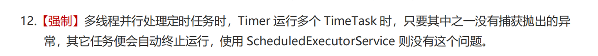

> **參考文章：**
> - [详解Spring Boot定时任务的几种实现方案](https://zhuanlan.zhihu.com/p/13044683723 "详解Spring Boot定时任务的几种实现方案")

# 古老定时任务工具Timer
Timer 是比较古老的定时任务工具，不推荐使用了，在 Java 1.3 引入的用于执行定时任务。

Timer 是通过单线程调度任务的，使用 Timer 类和 TimerTask 类配合实现定时任务。

示例如下：

```java
public class TimerTest {
    public static void main(String[] args) {
        TimerTask task1 = new TimerTask() {
            @SneakyThrows
            @Override
            public void run() {
                System.out.println("task1  run:"+ new Date());
                TimeUnit.SECONDS.sleep(6);
            }
        };
        TimerTask task2 = new TimerTask() {
            @Override
            public void run() {
                System.out.println("task2  run:"+ new Date());
            }
        };
        System.out.println("开始执行了。。。" + new Date());
        Timer timer = new Timer();
        //安排指定的任务在指定的时间开始进行重复的固定延迟执行。这里是0秒延时即立即执行，每10秒执行一次
        timer.schedule(task1,0,10000);
        timer.schedule(task2,0,10000);
    }
}
```

执行结果：

```shell
开始执行了。。。Mon Dec 16 10:32:19 CST 2024
task1  run:Mon Dec 16 10:32:19 CST 2024
task2  run:Mon Dec 16 10:32:25 CST 2024
```

可以看出 task1 和 task2 虽然都是同时启动执行任务，但是执行时间相隔 6s，正好是 task1 执行任务睡眠的时间。

这有力的说明了 Timer 是单线程执行任务的，也就是 task1 执行完了，task2 才执行。

```java
public class TimerTest {
    public static void main(String[] args) {
        TimerTask task1 = new TimerTask() {
            @SneakyThrows
            @Override
            public void run() {
                System.out.println("task1  run:"+ new Date());
                TimeUnit.SECONDS.sleep(6);
                throw new RuntimeException("task1 error...");
            }
        };
        TimerTask task2 = new TimerTask() {
            @Override
            public void run() {
                System.out.println("task2  run:"+ new Date());
            }
        };
        System.out.println("开始执行了。。。" + new Date());
        Timer timer = new Timer();
        //安排指定的任务在指定的时间开始进行重复的固定延迟执行。这里是每10秒执行一次
        timer.schedule(task1,0,10000);
        timer.schedule(task2,0,10000);
    }
}
```

执行结果：

```shell
开始执行了。。。Mon Dec 16 10:39:26 CST 2024
task1  run:Mon Dec 16 10:39:26 CST 2024
Exception in thread "Timer-0" java.lang.RuntimeException: task1 error...
  at com.shepherd.basedemo.schedule.TimerTest$1.run(TimerTest.java:25)
  at java.util.TimerThread.mainLoop(Timer.java:555)
  at java.util.TimerThread.run(Timer.java:505)
  
Process finished with exit code 0
```

这里我给出了控制台的全部输出结果，由此可见在 task1 报错了，整个任务就停掉了，既没有执行 task2，

也没有按照定时需求 10s 后再次执行，这显然是不行的。

其实在阿里巴巴 Java 开发手册中就有明确规定不再允许使用 Timer 来实现定时任务。



# ScheduledExecutorService
ScheduledExecutorService 是 Java 1.5 引入的，是 java.util.concurrent 包的一部分。

提供线程池支持，允许多个任务并行执行。

是现代化、高效、线程安全的任务调度工具，推荐使用。

简单来说就是该类是基于线程池设计的定时任务类，每个调度任务都会分配到线程池中的一个线程去执行，也就是说，任务是并发执行，互不影响。

话不多说直接看示例：

```java
public class TimerTest {
    public static void main(String[] args) {
        ScheduledExecutorService scheduler = Executors.newScheduledThreadPool(3);

        // 任务1：延时任务  5秒后执行，只执行1次
        scheduler.schedule(() -> System.out.println("task1 run: " + new Date() + " threadName：" + Thread.currentThread().getName()), 5, TimeUnit.SECONDS);

        // 任务2：延迟1秒后执行，每隔2秒执行一次
        scheduler.scheduleAtFixedRate(() -> {
            System.out.println("task2 run: " + new Date() + " threadName："
                    + Thread.currentThread().getName());
        }, 1, 2, TimeUnit.SECONDS);

        // 任务3：上一个任务结束后，延迟2秒执行
        scheduler.scheduleWithFixedDelay(() -> {
            System.out.println("task3 run: " + new Date() + " threadName："
                    + Thread.currentThread().getName());
        }, 1, 2, TimeUnit.SECONDS);
    }
}
```

执行结果：

```shell
task2 run: 2024-12-16 11:40:06 threadName：pool-1-thread-1
task3 run: 2024-12-16 11:40:06 threadName：pool-1-thread-2
task2 run: 2024-12-16 11:40:08 threadName：pool-1-thread-1
task3 run: 2024-12-16 11:40:08 threadName：pool-1-thread-3
task2 run: 2024-12-16 11:40:10 threadName：pool-1-thread-1
task1 run: 2024-12-16 11:40:10 threadName：pool-1-thread-2
task3 run: 2024-12-16 11:40:10 threadName：pool-1-thread-3
task2 run: 2024-12-16 11:40:12 threadName：pool-1-thread-1
task3 run: 2024-12-16 11:40:12 threadName：pool-1-thread-2
task2 run: 2024-12-16 11:40:14 threadName：pool-1-thread-3
task3 run: 2024-12-16 11:40:14 threadName：pool-1-thread-1
task2 run: 2024-12-16 11:40:16 threadName：pool-1-thread-1
task3 run: 2024-12-16 11:40:16 threadName：pool-1-thread-3
```

从结果上来看 `ScheduledExecutorService` 确实是多线程的，同一时间两个任务执行顺序不定且互相独立。

使用起来非常简单直接。我们也注意到 task1 有且仅执行了一次，这不就是妥妥的延时任务吗，需要实现简单延时任务完全可以使用它来搞定。

既然 `ScheduledExecutorService` 是当前 Java 提供的主流定时任务并推荐使用，我们这里就来好好分析下吧，先来来看看其定义如下所示:

```java
public interface ScheduledExecutorService extends ExecutorService {
    public ScheduledFuture<?> schedule(Runnable command,
                                       long delay, TimeUnit unit);
    public <V> ScheduledFuture<V> schedule(Callable<V> callable,
                                           long delay, TimeUnit unit);
    public ScheduledFuture<?> scheduleAtFixedRate(Runnable command,
                                                  long initialDelay,
                                                  long period,
                                                  TimeUnit unit);
    public ScheduledFuture<?> scheduleWithFixedDelay(Runnable command,
                                                     long initialDelay,
                                                     long delay,
                                                     TimeUnit unit);
}
```

该接口继承了 `Java` 并发包线程池工具封装的上次接口 `ExecutorService`，这就意味着 `ScheduledExecutorService` 拥有多线程处理任务的能力。

其核心实现类是：

```java
public class ScheduledThreadPoolExecutor
        extends ThreadPoolExecutor
        implements ScheduledExecutorService {
    // ...
}
```

可以看到 `ScheduledThreadPoolExecutor` 继承了 `ThreadPoolExecutor`，`ThreadPoolExecutor` 不正是 Java 并发包实现线程池的核心类吗

### 主要方法
- schedule(Runnable command, long delay, TimeUnit unit)：延迟执行任务。

- scheduleAtFixedRate(Runnable command, long initialDelay, long period, TimeUnit unit)：以固定的速率重复执行任务。

- scheduleWithFixedDelay(Runnable command, long initialDelay, long delay, TimeUnit unit)：以固定的延迟重复执行任务。

### 参数含义：这里以 scheduleAtFixedRate 方法为例

- Runnable command: 任务体，也就是定时任务执行的核心逻辑

- long initialDelay: 首次执行的延时时间

- long period: 任务执行间隔

- TimeUnit unit: 首次延时执行和周期间隔时间单位

### 如果需要取消任务，可以使用 Future 对象：
```java
ScheduledExecutorService scheduler = Executors.newScheduledThreadPool(1);
ScheduledFuture<?> future = scheduler.schedule(() -> System.out.println("Task executed"), 5, TimeUnit.SECONDS);

// 取消任务
future.cancel(false);
```