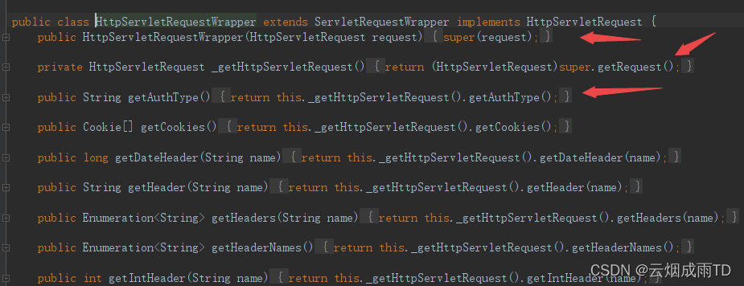

> **參考文章：**
> [使用HttpServletRequestWrapper 解决流只能读取一次的问题](https://blog.csdn.net/qq_43437874/article/details/122102362 "使用HttpServletRequestWrapper 解决流只能读取一次的问题")

# 问题场景

在使用 `@Aspect` 进行切面配置打印请求日志时，获取了请求参数，然后在访问接口中，又调用了工具类去获取请求参数，发生异常。

错误信息如下:

```shell
// 在使用getInputStream方法时，发现InputStream已经被读取了。
java.lang.IllegalStateException: getInputStream() has already been called for this request
	at org.apache.catalina.connector.Request.getReader(Request.java:1222)
	at org.apache.catalina.connector.RequestFacade.getReader(RequestFacade.java:504)
	at javax.servlet.ServletRequestWrapper.getReader(ServletRequestWrapper.java:230)
	at javax.servlet.ServletRequestWrapper.getReader(ServletRequestWrapper.java:230)
	at javax.servlet.ServletRequestWrapper.getReader(ServletRequestWrapper.java:230)
	at com.hoodev.toolkit.util.HttpUtil.readRequestBody(HttpUtil.java:406)
	at com.hoodev.toolkit.util.HttpUtil.readParameter(HttpUtil.java:383)
	at org.prime.core.boot.log.aspect.RequestLogAspect.requestAspect(RequestLogAspect.java:64)
	at sun.reflect.NativeMethodAccessorImpl.invoke0(Native Method)
	at sun.reflect.NativeMethodAccessorImpl.invoke(NativeMethodAccessorImpl.java:62)
	at sun.reflect.DelegatingMethodAccessorImpl.invoke(DelegatingMethodAccessorImpl.java:43)
	at java.lang.reflect.Method.invoke(Method.java:498)
	at org.springframework.aop.aspectj.AbstractAspectJAdvice.invokeAdviceMethodWithGivenArgs(AbstractAspectJAdvice.java:644)
	at org.springframework.aop.aspectj.AbstractAspectJAdvice.invokeAdviceMethod(AbstractAspectJAdvice.java:633)
	at org.springframework.aop.aspectj.AspectJAroundAdvice.invoke(AspectJAroundAdvice.java:70)
	at org.springframework.aop.framework.ReflectiveMethodInvocation.proceed(ReflectiveMethodInvocation.java:175)
	at org.springframework.aop.framework.CglibAopProxy$CglibMethodInvocation.proceed(CglibAopProxy.java:749)
	at org.springframework.aop.interceptor.ExposeInvocationInterceptor.invoke(ExposeInvocationInterceptor.java:95)
	at org.springframework.aop.framework.ReflectiveMethodInvocation.proceed(ReflectiveMethodInvocation.java:186)
	at org.springframework.aop.framework.CglibAopProxy$CglibMethodInvocation.proceed(CglibAopProxy.java:749)
	at org.springframework.aop.framework.CglibAopProxy$DynamicAdvisedInterceptor.intercept(CglibAopProxy.java:691)
	at com.hnmqet.example.consume.controller.AreaMainController$$EnhancerBySpringCGLIB$$ac12e51d.list(<generated>)
	at sun.reflect.NativeMethodAccessorImpl.invoke0(Native Method)
	at sun.reflect.NativeMethodAccessorImpl.invoke(NativeMethodAccessorImpl.java:62)
	at sun.reflect.DelegatingMethodAccessorImpl.invoke(DelegatingMethodAccessorImpl.java:43)
	at java.lang.reflect.Method.invoke(Method.java:498)
	at org.springframework.web.method.support.InvocableHandlerMethod.doInvoke(InvocableHandlerMethod.java:190)
	at org.springframework.web.method.support.InvocableHandlerMethod.invokeForRequest(InvocableHandlerMethod.java:138)
	at org.springframework.web.servlet.mvc.method.annotation.ServletInvocableHandlerMethod.invokeAndHandle(ServletInvocableHandlerMethod.java:105)
	at org.springframework.web.servlet.mvc.method.annotation.RequestMappingHandlerAdapter.invokeHandlerMethod(RequestMappingHandlerAdapter.java:878)
	at org.springframework.web.servlet.mvc.method.annotation.RequestMappingHandlerAdapter.handleInternal(RequestMappingHandlerAdapter.java:792)
	at org.springframework.web.servlet.mvc.method.AbstractHandlerMethodAdapter.handle(AbstractHandlerMethodAdapter.java:87)
	at org.springframework.web.servlet.DispatcherServlet.doDispatch(DispatcherServlet.java:1040)
	at org.springframework.web.servlet.DispatcherServlet.doService(DispatcherServlet.java:943)
	at org.springframework.web.servlet.FrameworkServlet.processRequest(FrameworkServlet.java:1006)
	at org.springframework.web.servlet.FrameworkServlet.doPost(FrameworkServlet.java:909)
	at javax.servlet.http.HttpServlet.service(HttpServlet.java:652)
	at org.springframework.web.servlet.FrameworkServlet.service(FrameworkServlet.java:883)
	at javax.servlet.http.HttpServlet.service(HttpServlet.java:733)
	at org.apache.catalina.core.ApplicationFilterChain.internalDoFilter(ApplicationFilterChain.java:231)
	at org.apache.catalina.core.ApplicationFilterChain.doFilter(ApplicationFilterChain.java:166)
	at org.apache.tomcat.websocket.server.WsFilter.doFilter(WsFilter.java:53)
	at org.apache.catalina.core.ApplicationFilterChain.internalDoFilter(ApplicationFilterChain.java:193)
	at org.apache.catalina.core.ApplicationFilterChain.doFilter(ApplicationFilterChain.java:166)
```

# 原因分析

首先看下通过 `Request` 获取流进入的方法，该方法进入的是 `Tomcat` 中的 `Request` 类。

```java
public ServletInputStream getInputStream() throws IOException {
    // 1. 判断usingReader 属性，为真则抛出异常IllegalStateException
    if (this.usingReader) {
        throw new IllegalStateException(sm.getString("coyoteRequest.getInputStream.ise"));
    } else {
        // 2. 设置usingInputStream 属性为True
        this.usingInputStream = true;
        if (this.inputStream == null) {
            // 3. 获取流
            this.inputStream = new CoyoteInputStream(this.inputBuffer);
        }
        return this.inputStream;
    }
}
```

然后再看下 getReader 方法

```java
public BufferedReader getReader() throws IOException {
    // 1. 判断usingInputStream 属性，为真则抛出异常IllegalStateException
    if (this.usingInputStream) {
        throw new IllegalStateException(sm.getString("coyoteRequest.getReader.ise"));
    } else {
        if (this.coyoteRequest.getCharacterEncoding() == null) {
            Context context = this.getContext();
            if (context != null) {
                String enc = context.getRequestCharacterEncoding();
                if (enc != null) {
                    this.setCharacterEncoding(enc);
                }
            }
        }
        // 设置usingReader 为真
        this.usingReader = true;
        this.inputBuffer.checkConverter();
        if (this.reader == null) {
            this.reader = new CoyoteReader(this.inputBuffer);
        }

        return this.reader;
    }
}
```

通过以上源码，可以了解到，在获取流的过程时，会设置 `usingReader` 、 `usingInputStream` 为真，表示该流已经被读取过了，再次获取时，则就会直接抛出 `IllegalStateException` 异常。

> **本质原因：** 
> 因为流在读取的时候，比如 `read()`，文件存放在硬盘上，JVM 只能通过操作系统 OS 读取文件
> `read()` 每次读取时，都会进行标记记录当前读取的位置，下次读取时，从标记位置开始，一直到结束时返回-1。
> 结束后再次读取时，则直接返回 -1 了，所以 IO 流是无法重复读取的，只能读取一次。

# 解决方案: 自定义实现 HttpServletRequestWrapper
### 1. HttpServletRequestWrapper 简介

`HttpServletRequestWrapper` 是 `tomcat` 提供的基于 `HTTP` 的 `Servlet` 请求包装类，继承自 `ServletRequestWrapper`，并实现了 `HttpServletRequest`， 所以它本质上也是一个 `HttpServletRequest`。

```java
public class HttpServletRequestWrapper extends ServletRequestWrapper implements
        HttpServletRequest {
}
```

官方注释如下：提供了一个 `HttpServletRequest` 接口实现，此类实现包装器或装饰器模式，所有方法默认为调用包装器的方法，开发人员可以实现此类，来自定义请求对象。

可以看到该类的构造函数，调用了父类的构造，然后所有的执行方法，都会先调用 `_getHttpServletReques` 获取到父类的 `HttpServletRequest`，再通过 `HttpServletRequest` 获取请求中的信息。



> 简单来说，`HttpServletRequestWrapper` 就是一个请求包装类，我们可以通过该类对请求进行装饰，比如对参数、编码方式等等进行重新设置。

### 2. 自定义实现类

通过以上，可以了解到，我们可以继承 `HttpServletRequestWrapper` ，然后定义一个缓存，第一次获取时对缓存进行赋值，每次获取流时，都将缓存中的流再 new 一次，重新创建一个流对象，这样就能实现多次读取流了。

```java
/**
 * 构建可重复读取inputStream的request
 * 
 * @author ruoyi
 */
public class RepeatedlyRequestWrapper extends HttpServletRequestWrapper
{
    private final byte[] body;

    public RepeatedlyRequestWrapper(HttpServletRequest request, ServletResponse response) throws IOException
    {
        super(request);
        request.setCharacterEncoding(Constants.UTF8);
        response.setCharacterEncoding(Constants.UTF8);

        body = HttpHelper.getBodyString(request).getBytes(Constants.UTF8);
    }

    @Override
    public BufferedReader getReader() throws IOException
    {
        return new BufferedReader(new InputStreamReader(getInputStream()));
    }

    @Override
    public ServletInputStream getInputStream() throws IOException
    {
        final ByteArrayInputStream bais = new ByteArrayInputStream(body);
        return new ServletInputStream()
        {
            @Override
            public int read() throws IOException
            {
                return bais.read();
            }

            @Override
            public int available() throws IOException
            {
                return body.length;
            }

            @Override
            public boolean isFinished()
            {
                return false;
            }

            @Override
            public boolean isReady()
            {
                return false;
            }

            @Override
            public void setReadListener(ReadListener readListener)
            {

            }
        };
    }
}
```

### 3. 添加过滤器

然后还需要定义一个过滤器，将包装类设置到 `Request` 中，传递给下游使用。

```java
/**
 * Repeatable 过滤器
 * 
 * @author ruoyi
 */
public class RepeatableFilter implements Filter
{
    @Override
    public void init(FilterConfig filterConfig) throws ServletException
    {

    }

    @Override
    public void doFilter(ServletRequest request, ServletResponse response, FilterChain chain)
            throws IOException, ServletException
    {
        ServletRequest requestWrapper = null;
        if (request instanceof HttpServletRequest
                && StringUtils.startsWithIgnoreCase(request.getContentType(), MediaType.APPLICATION_JSON_VALUE))
        {
            requestWrapper = new RepeatedlyRequestWrapper((HttpServletRequest) request, response);
        }
        if (null == requestWrapper)
        {
            chain.doFilter(request, response);
        }
        else
        {
            chain.doFilter(requestWrapper, response);
        }
    }

    @Override
    public void destroy()
    {

    }
}
```