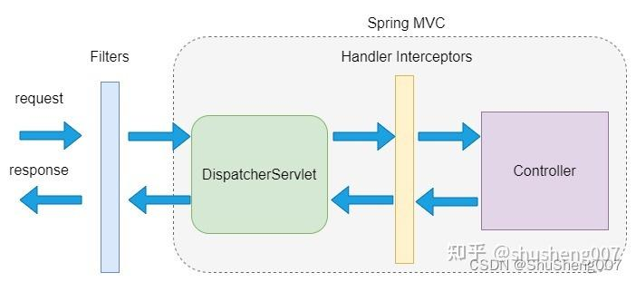
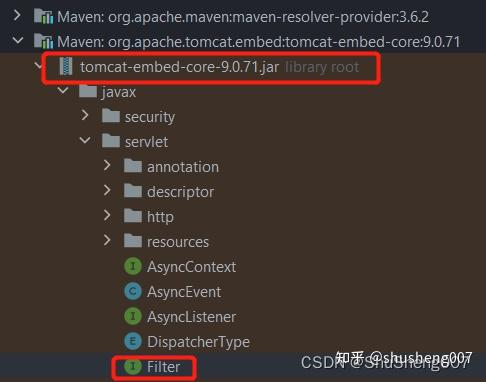

> **參考文章：**
> [秒懂SpringBoot之Filter与HandlerInterceptor异同](https://zhuanlan.zhihu.com/p/686883935 "秒懂SpringBoot之Filter与HandlerInterceptor异同")

# 概述

在日常开发中，我们会经常用到 `Filter` 和 `HandlerInterceptor`，刚接触时感觉二者差不多，那二者有什么异同呢？

谁先执行谁后执行呢？分别在什么场景下使用呢？接下来让我们看一下

# 前置知识

先上一张偶亲手画的图吧，正所谓一图胜千言，不理解无所谓，我们一起来看下。



你有没有觉得在一个熟悉的领域学习相关的新知识就非常容易理解，因为他们直接环环相扣，互相联系，这就是所谓的经验的优势。

例如我们今天要谈论的 `Filter` 和 `HandlerIntercetor`，如果你不具备 `Sevlet` 以及 `SpringMvc` 原理的基础知识就会显得很晦涩，

而对于有这部分知识的同学就会显得非常的简单易懂。此处我简单描述一下，作为理解下面内容的背景知识。

1. 利用 `SpringMvc` 开发的 `Web` 程序需要运行在 `Servlet` 容器中（Web服务器），例如 `Tomcat`。

2. `SpringMvc` 使用一个叫 `DispatcherServlet` 的组件来接收所有的请求，然后分发给我们写的 `Controller`。

假设我们使用 `springboot` 写了一个 `helloworld` 的 `web` 程序，使用内置的 `Tomcat`来运行，那么一个请求过来会按照下面的路径处理。

```text
request --> tomcat --> filter --> dispatcherSevlet --> handlerInterceptor --> controller
```

# Filter

### 原理及使用场景

首先 `Filter` 不属于 `Spring` 框架，而是属于 `WebServer` 的，例如 `Tomcat`，其位于 `org.apache.tomcat.embed:tomcat-embed-core` 中



因为请求到达 `servlet` 之前都要经过 `Filter`，在此我们可以访问 `Request` 和 `Response`，因而可以做很多切面性的工作，最典型的就是授权和认证。

例如 `Spring Security` 就是使用 `Filter` 工作的。

### 使用

在 `springboot` 程序中实现一个 `Filter` 非常简单，只需要实现 `javax.servlet.Filter` 接口并使用 `@Componse` 标记即可

```java
@Slf4j
@Component
public class AuthFilter implements Filter {
    @Override
    public void doFilter(ServletRequest servletRequest, ServletResponse servletResponse, FilterChain filterChain) throws IOException, ServletException {
        HttpServletRequest request = (HttpServletRequest) servletRequest;
        log.info("AuthFilter请求url：{}", request.getRequestURL());

        filterChain.doFilter(servletRequest, servletResponse);
    }
}
```

在 `doFilter` 方法中我们可以拿到 `ServletRequest` 和 `ServletResponse`，因而可以获取到非常多请求相关的信息，然后根据自己的业务来处理即可

# 执行顺序

既然有多个 `Filter`，那么就会存在执行顺序问题，我们如何控制多个 `Filter` 的执行顺序呢？

可以使用 `@Order` 注解

```java
@Slf4j
@Order(1)
@Component
public class AuthFilter implements Filter {
    ...
}
```

`order` 里的数字越小越早执行。

# 设置 Filter 作用范围

默认情况下 `Filter` 将作用于每个请求，我们可以设置让其只作用于某些特定的请求，例如我我们设置 `AuthFilter` 只作用于 `/auth` 开头的请求。在这里也可以设置执行顺序，其优先级高于 `@Order`。

```java
@Configuration
public class FilterConfiguration {
    @Autowired
    private AuthFilter authFilter;

    @Bean
    public FilterRegistrationBean<AuthFilter> filterRegistrationBean() {
        FilterRegistrationBean<AuthFilter> registrationBean = new FilterRegistrationBean<>();
        registrationBean.setFilter(authFilter);
        registrationBean.addUrlPatterns("/auth/*");
        registrationBean.setOrder(0);
        return registrationBean;
    }
}
```

通过这种方法还可以使用第三方的 `Filter`。

# HandlerInterceptor
### 原理及使用场景

`HandlerInterceptor` 是 `SpringMvc` 的组件，其位于 `DispatcherServlet` 与 `Controller` 之间。其位于 `org.springframework:spring-webmvc` 中。

### 使用
在 `springboot` 程序中实现一个 `HandlerInterceptor` 较为简单，但是比 `Filter` 难一点，需要两步。

### 实现 `org.springframework.web.servlet.HandlerInterceptor` 接口

其包含 3 个 `default` 方法，我们选择性的实现即可，`preHandle` 使用的频率更高。

`preHandle`：在 `Controller` 方法执行之前执行
`postHandle`：在 `Controller` 方法执行以后，但是还没有渲染页面之前执行。

这就是它为什么多了一个 `ModelAndView` 类型的参数，但是如今流行前后端分离，所以一般都是返回 `json` 数据给前端，不会返回 `html` 页面，所以这个参数几乎不怎么用的到。

`afterCompletion`： 在 `Controller` 方法完全执行完毕后触发

下面是一个实现。

```java
@Slf4j
public class LogInterceptor implements HandlerInterceptor {
    @Override
    public boolean preHandle(HttpServletRequest request, HttpServletResponse response, Object handler) throws Exception {
        log.info("preHandle {}:{}:{}",request.getRequestURL(),response.getStatus(),handler);
        return true;
    }

    @Override
    public void postHandle(HttpServletRequest request, HttpServletResponse response, Object handler, ModelAndView modelAndView) throws Exception {
        log.info("postHandle {}:{}:{}:{}",request,response,handler,modelAndView);
    }

    @Override
    public void afterCompletion(HttpServletRequest request, HttpServletResponse response, Object handler, Exception ex) throws Exception {
        log.info("afterCompletion {}:{}:{}:{}",request,response,handler,ex);
    }
}
```

### 配置

有了 `Interceptor` 还需要使其生效，我们需要实现 `org.springframework.web.servlet.config.annotation.WebMvcConfigurer`。

因为 `SpringBoot` 已经默认启用了 `@EnableWebMvc`，所以可以使用这个接口的实现类配置 `web` 相关的功能，这个接口的可配置项纷繁复杂，幸好 `SpringBoot` 已经帮我们配置了默认值，不然就蛋疼了... 这里我们只需要重写 `addInterceptors` 即可

```java
@Configuration
public class WebConfig implements WebMvcConfigurer {

    @Override
    public void addInterceptors(InterceptorRegistry registry) {
        registry.addInterceptor(new LogInterceptor());
    }
}
```

# 二者异同
### 共同点

在 `SpringMvc` 中二者均可以实现切面性的工作。

### 不同点

首先两个东西隶属于不同的框架，`Filter` 更具通用性，粒度更粗。

例如你只能从 `Filter` 里面拿到 `http` 请求相关的信息，而拿不到应用层面的信息，例如你写的那个 `Controller` 里面的信息。

`HandlerInterceptor` 属于 `SpringMvc` 的，它的通用性更差，但是控制粒度更细，因为可以获取到应用层面的信息了。

例如我现在想在 `log` 中记录类名和方法名，`Filter` 就做不到，但是 `SpringSecurity` 这类业务无关框架却又不能使用 `Interceptor`。

### 总结

总之二者各有各的适用场景，合适的才是最好的。这就跟找对象是一样一样的，合适当前场景的才是最好的，随着时间的流逝情况也许会有变化，到时候重构就好了。