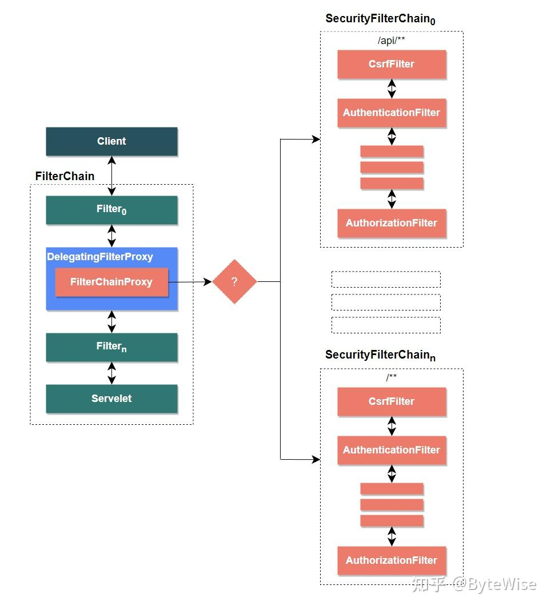

> **參考文章：** [一文带你读懂Spring Security 6.0的实现原理](https://zhuanlan.zhihu.com/p/645992801 "一文带你读懂Spring Security 6.0的实现原理") 

# Java Web 应用的 Security 实现基本思路

大家可以尝试思考下，安全相关的校验和处理，应该处于应用的哪个部分呢？答案是，应该放在所有请求的入口，因为它是跟具体的业务逻辑无关的，在 `Spring MVC` 世界里就是 `@Controller` 之前。

在 `JakartaEE` (`JavaEE`的新版)规范中，`Filter` 和 `Servlet` 都符合这个前置要求。然而，`Spring` 的 `Web`应用基本上只包含一个 `DispatcherServelt`，主要用于请求分发，缺乏安全相关的支持和合适的扩展机制。

而 `Filter` 运行在 `Servlet` 之前，而规范本身就支持配置多个 `Filter`。因此，在请求到达 `Servlet` 之前，先通过 `Filter` 进行安全验证就是一个非常合理的实现方式。

这样可以在请求进入业务逻辑之前，对请求进行拦击，然后进行必要的安全性检查和处理。

这也是 `Spring Security` 的实现方式。本质上，`Spring Security` 的实现原理很简单，就是提供了一个用于安全验证的 `Filter`。假如我们自己实现一个简化版的 `Filter`，它的大概逻辑应该是这样的：

```java
public class SimpleSecurityFilter extends HttpFilter {
    @Override
    protected void doFilter(HttpServletRequest request, HttpServletResponse response, FilterChain chain) throws IOException, ServletException {
        UsernamePasswordToken token = extractUsernameAndPasswordFrom(request);  // (1)
        if (notAuthenticated(token)) {  // (2)
            // 用户名密码错误
            response.setStatus(HttpServletResponse.SC_UNAUTHORIZED); // HTTP 401.
            return;
        }
        if (notAuthorized(token, request)) { // (3)
            // 当前登录用户的权限不足
            response.setStatus(HttpServletResponse.SC_FORBIDDEN); // HTTP 403
            return;
        }
        // 通过了身份验证和权限校验，继续执行其它Filter，最终到达Servlet
        chain.doFilter(request, response); // (4)
    }
}
```

### FilterChain

在安全领域，由于攻防手段的多样性和认证鉴权方式的复杂性，将所有功能都放在一个 `Filter` 中会导致该 `Filter` 迅速演变为一个庞大而复杂的类。

因此，在实际应用场景中，我们常常将这个庞大的 `Filter` 拆分成多个小 `Filter`，并将它们链接在一起。

每个 `Filter` 都只负责特定领域的功能，比如 `CsrfFilter`，`AuthenticationFilter`，`AuthorizationFilter` 等。

这种概念被称为 `FilterChain`，实际上 `JarkataEE` 规范也有相识的概念。通过使用 `FilterChain`，你就可以以插拔的方式添加或移除特定功能的 `Filter`，而无需改动现有的代码。

# Spring Security 框架的基本架构和原理

上一节其实已经说明了 `Spring Security` 框架的基本思路，下面我们深入分析其实现原理和架构。

### 实现原理

`Spring Security` 通过 `DefaultSecurityFilterChain` 类来完成安全相关的功能，而该类本身又由其它 `Filter` 组成。

默认情况下，`Spring Security Starter` 引入了 15 个 `Filter`，下面我们简要介绍下其中几个重要的 `Filter`：

1. `CsrfFilter`：这个 `Filter` 用于防止跨站点请求伪造攻击，这也是导致所有 `POST` 请求都失败的原因。基于 `Token` 验证的 `API` 服务可以选择关闭 `CsrfFilter`，而一般Web页面需要开启。
2. `BasicAuthenticationFilter`：支持 `HTTP` 的标准 `Basic Auth` 的身份验证模块。
3. `UsernamePasswordAuthenticationFilter`：支持 `Form` 表单形式的身份验证模块。
4. `DefaultLoginPageGeneratingFilter` 和 `DefaultLogoutPageGeneratingFilter`：用于自动生成登录页面和注销页面。
5. `AuthorizationFilter`：这个 `Filter` 负责授权模块。值得注意的是，在老版本中鉴权模块是 `FilterSecurityInterceptor` .

> 这些 `Filter` 构成了 `Spring Security` 的核心功能，通过它们，我们可以实现身份验证、授权、防护等安全特性。根据应用的需求，我们可以选择启用或禁用特定的 `Filter`，以定制和优化安全策略。

##### SecurityFilterChain

`DefaultSecurityFilterChain` 类实现了 `SecurityFilterChain` 接口，我们打开这个接口的源码，会发现它只有两个方法，`matches` 用于匹配特定的 `Http` 请求（比如特定规则的URL），`getFilters` 用于获取可用的所有 `Security Filter`。

```java
public interface SecurityFilterChain {
    boolean matches(HttpServletRequest request); // 规则匹配
    List<Filter> getFilters(); // 该FilterChain下的所有Security Filter
}
```

从这段代码可以得出两个结论：

1. 不同的 `Http` 请求可以对应不同的 `SecurityFilterChain`（通过 `matches` 方法）。
2. `SecurityFilterChain` 不是我们以为的 `JakartaEE` 的 `Servlet Filter` 实现，它仅仅是一个包含多个 `Filter` 的容器，本身不负责调度和执行。它只是一个配置项，用于指定一组 `Filter`，以实现特定的安全需求。

##### DelegatingFilterProxy

实际上，`JakartaEE` 层面上的 `Filter` 实现是 `DelegatingFilterProxy` 类，它在 `Spring Security` 中起到了一个重要的桥梁作用，连接了 `Servlet` 容器和 `Spring` 容器。

`Servlet` 容器不了解 `Spring` 定义的 `Beans`，而 `Spring Security` 的大部分组件及其依赖都是注册到 `Spring` 容器中的 `Bean`。

`DelegatingFilterProxy` 核心代码的主要工作就是从 `WebApplicationContext` 获取指定名称的 `Filter Bean`，然后委托给这个 `Bean`的 `doFilter`方法。以下是简化后的伪代码：

```java
public void doFilter(ServletRequest request, ServletResponse response, FilterChain filterChain)
        throws ServletException, IOException {
    Filter delegateToUse = this.delegate;
    if (delegateToUse == null) {
        synchronized (this.delegateMonitor) {
            delegateToUse = this.delegate;
            if (delegateToUse == null) {
                WebApplicationContext wac = findWebApplicationContext();
                // 获取Filter Bean并初始化
                delegateToUse = initDelegate(wac);
            }
            this.delegate = delegateToUse;
        }
    }
    // 委托给的delegate对象完成实际的doFilter
    invokeDelegate(delegateToUse, request, response, filterChain);
}

protected Filter initDelegate(WebApplicationContext wac) throws ServletException {
    // Bean名称配置在SecurityFilterAutoConfiguration.DEFAULT_FILTER_NAME = "springSecurityFilterChain"
    String targetBeanName = getTargetBeanName();
    // 从容器中获取指定名称的Filter类型Bean
    Filter delegate = wac.getBean(targetBeanName, Filter.class);
    if (isTargetFilterLifecycle()) {
        delegate.init(getFilterConfig());
    }
    return delegate;
}
```

通过这种方式，`DelegatingFilterProxy` 实现了将 `Servlet` 容器中的 `Filter` 请求委托给 `Spring` 容器中的具体 `Filter Bean` 处理，从而实现了 `Servlet` 容器和 `Spring` 容器之间的无缝连接。

##### FilterChainProxy

而这个被委托的 `Filter Bean` 的类型就是 `FilterChainProxy`，是在 `WebSecurityConfiguration` 中配置的：

```java
// name = "springSecurityFilterChain"
@Bean(name = AbstractSecurityWebApplicationInitializer.DEFAULT_FILTER_NAME)
public Filter springSecurityFilterChain() throws Exception {
    // 配置SecurityFilterChain
    boolean hasFilterChain = !this.securityFilterChains.isEmpty();
    if (!hasFilterChain) {
        this.webSecurity.addSecurityFilterChainBuilder(() -> {
            this.httpSecurity.authorizeHttpRequests((authorize) -> authorize.anyRequest().authenticated());
            this.httpSecurity.formLogin(Customizer.withDefaults());
            this.httpSecurity.httpBasic(Customizer.withDefaults());
            return this.httpSecurity.build();
        });
    }
    for (SecurityFilterChain securityFilterChain : this.securityFilterChains) {
        this.webSecurity.addSecurityFilterChainBuilder(() -> securityFilterChain);
    }
    // WebSecurity自定义配置
    for (WebSecurityCustomizer customizer : this.webSecurityCustomizers) {
        customizer.customize(this.webSecurity);
    }
    // FilterChainProxy最终是由WebSecurity构建出来的
    return this.webSecurity.build();
}
```

从上面代码可以发现，`FilterChainProxy` 对象最终是由 `WebSecurity` 根据 `SecurityFilterChain` 和其它一些配置构建出来的。

`FilterChainProxy` 主要作用就是查找匹配当前 `Http` 请求规则的 `SecurityFilterChain`，然后将工作委派给 `SecurityFilterChain` 的所有 `Filter`。简化后的伪代码如下所示：

```java
public void doFilter(ServletRequest request, ServletResponse response, FilterChain chain) throws IOException, ServletException {
    // 获取匹配的所有Filter
    List<Filter> filters = getFilters(request); 
    // 按顺序执行Filter
    Filter nextFilter = this.filters.get(this.currentPosition - 1);
    nextFilter.doFilter(request, response, this);
}

private List<Filter> getFilters(HttpServletRequest request) {
    for (SecurityFilterChain chain : this.filterChains) {
        // 返回匹配规则的SecurityFilterChain的Filter列表
        if (chain.matches(request)) { 
            return chain.getFilters();
        }
    }
    return null;
}
```

> 【Tips】`FilterChainProxy` 可以认为是整个 `Spring Security` 处理请求的一个起点，如果你遇到 `Security` 相关问题，又不清楚是具体哪个 `Filter` 导致的，就可以从这里开始 `Debug`。

### 基本架构

从上一节的内容，我们可以得出下面这一副架构图（图中蓝色和橘红色的部分代表 `Security Security`）。

从图中可以看出，`Spring Security` 框架通过 `DelegatingFilterProxy` 建立起了 `Servlet` 容器和 `Spring` 容器的链接，`FilterChainProxy` 基于匹配规则（比如 `URL` 匹配），决定使用哪个 `SecurityFilterChain`。

而 `SecurityFilterChain` 又由零到多个 `Filter` 组成，这些 `Filter` 完成实际的功能。

