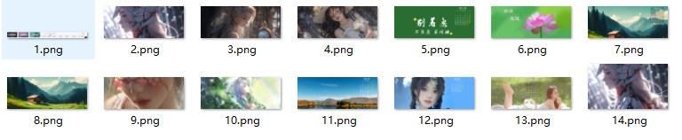
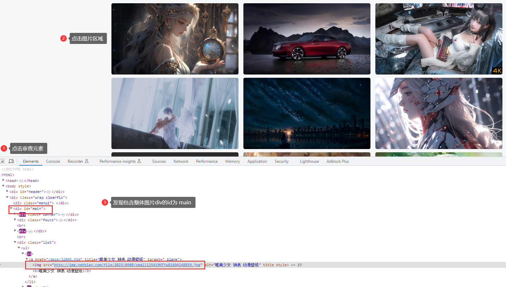
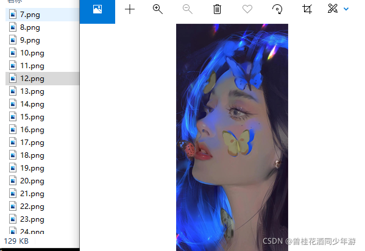

> **參考文章：** [Java如何快速获取网站图片](https://blog.csdn.net/qq_44231797/article/details/121343892 "Java如何快速获取网站图片")

# 前提

最近我的的朋友浏览一些网站，看到好看的图片，问我有没有办法不用手动一张一张保存图片！

我说用Jsoup丫！

[測試網站](http://www.netbian.com/ "测试网站")



> 打开开发者模式（F12），找到对应图片的链接，在互联网中，每一张图片就是一个链接！



# 一、新建Maven项目，导入Jsoup环境依赖

```xml
<dependency>
    <groupId>org.jsoup</groupId>
    <artifactId>jsoup</artifactId>
    <version>1.11.2</version>
</dependency>
```

# 二、编写代码

```java
public class JsoupTest {
	public static void main(String[] args) throws IOException {
		// 爬虫的网站
		String url="http://www.netbian.com/";

		// 获得网页的document对象
		Document document = Jsoup.parse(new URL(url), 10000);
		// 爬取含图片的代码部分
		Element content = document.getElementById("main");
		// 获取img标签代码  这是个集合
		Elements imgs = content.getElementsByTag("img");
		// 命名图片的id
		int id=0;
		for (Element img : imgs) {
			// 获取具体的图片
			String pic = img.attr("src");
	
			URL target = new URL(pic);
			// 获取连接对象
			URLConnection urlConnection = target.openConnection();
			// 获取输入流，用来读取图片信息
			InputStream inputStream = urlConnection.getInputStream();
			// 获取输出流  输出地址+文件名
			id++;
			FileOutputStream fileOutputStream = new FileOutputStream("E:\\JsoupPic\\" + id + ".png");

			int len=0;
			// 设置一个缓存区
			byte[] buffer = new byte[1024 * 1024];
			// 写出图片到E:\JsoupPic中,  输入流读数据到缓冲区中，并赋给len
			while ((len=inputStream.read(buffer))>0){
				// 参数一：图片数据  参数二：起始长度  参数三：终止长度
				fileOutputStream.write(buffer, 0, len);
			}
			System.out.println(id+".png下载完毕");
			// 关闭输入输出流 最后创建先关闭
			fileOutputStream.close();
			inputStream.close();
		}

	}
}
```



# 心得:
1、网络上的每一张图片都是一个链接
2、我们知道整个网页就是一个文档树，先找到包含图片的父id,再通过getElementsByTag（）获取到图片的标签，通过F12，我们知道图片的链接是存在img标签里面的 data-src属性中
3、通过标签的data-src属性，就获取到具体图片的链接
4、通过输入输出流，把图片保存在本地中！