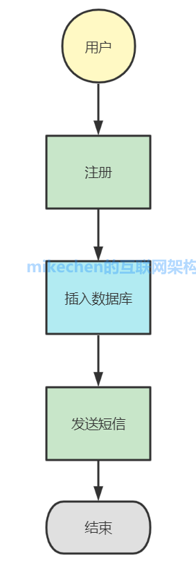
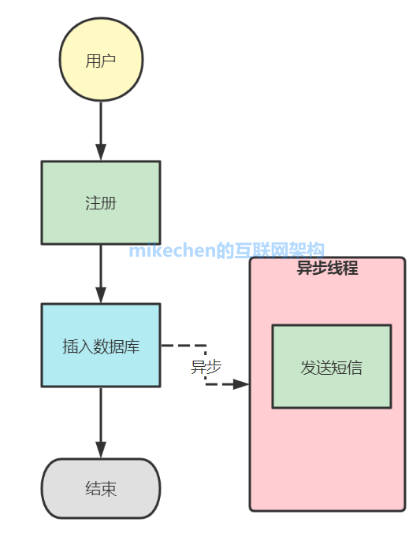

# 什么是异步？

首先我们先来看看一个同步的用户注册例子，流程如下：

在同步操作中，我们执行到插入数据库的时候，我们必须等待这个方法彻底执行完才能执行“发送短信”这个操作，如果插入数据库这个动作执行时间较长，发送短信需要等待，这就是典型的同步场景。

于是聪明的人们开始思考，如果两者关联性不强，能不能将一些非核心业务从主流程中剥离出来，于是有了异步编程雏形，改进后的流程如下：

这就是异步编程，它是程序并发运行的一种手段，它允许多个事件同时发生，当程序调用需要长时间运行的方法时，它不会阻塞当前的执行流程，程序可以继续运行。

---

# 使用异步任务

> 使用异步任务（Async Task）的主要目的是为了提高程序的响应速度和性能。异步任务允许程序在执行某些耗时操作时，不会阻塞主线程，从而使得主线程能够更快地响应用户的请求，提高用户体验。

实际开发中业务存在不同的任务场景，负责参与业务的任务可能并不是必须顺序执行，通过将一些耗时的操作放在一个单独的线程中执行，主线程就可以继续执行其他任务，可以避免了阻塞主线程，从而减少主线程返回结果的耗时。

---

