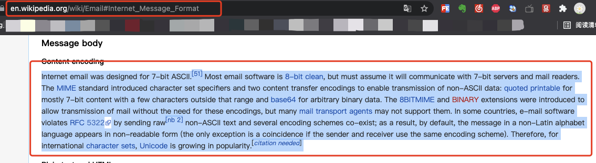
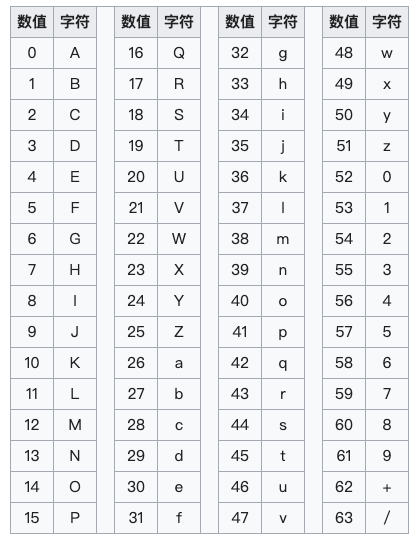

> **參考文章：**
> - [一文详解 Base64 编码原理](https://www.cnblogs.com/xiaxveliang/p/15097947.html)

最近在看Android的签名与验签机制，其中涉及到 MD5、SHA2、SHA256 等摘要算法，也涉及到 Base64 编码机制。这里先从简单的入手，记录一下 Base64 编码机制的原理。

# 一、Base64由来

Base64 是一种编码方式，最早出现在电子邮件传输协议中。
电子邮件问世之初，传递消息时只支持 ASCII 字符，后来随着电子邮件的广泛使用，传递非ASCII字符内容的需求增加，例如：传输中文、传输文件（图片、视频）。
为解决这一问题，最好的方案是在不改变传输协议的基础上，做一种扩展方案来支持非ASCII内容传输，把非 ASCII 字符用ASCII来表示，Base64编码应运而生。



---

# 二、Base64定义

Base64 是一种基于64个 ASCII 字符来表示二进制数据的表示方法。
Base64 将8比特位为一个单元的字节数据拆分为以6个比特位为一个单元的二进制片段，每6个比特位单元对应Base64索引表中的一个字符，这样最终构成一个超过编码前字节数据33%的字符串。

Base64 中64个可打印字符包括字母A-Z、a-z、数字0-9，此外还有两个字符为+和/，这样构成了共有64字符的Base64索引表：



---

# 三、Base64编码原理

Base64 将8比特位为一个单元的字节数据拆分为以6个比特位为一个单元的二进制片段；每6个比特位单元对应Base64索引表中的一个字符；
按照以上方式可以算出base64编码后的字符串大约比编码前增加了33%。

举例如下：
编码 Man 的Base64结果为TWFu，Base64编码计算过程如下：

```text
文      本：M        a        n
ASCII 编码：77       97       110
8bit  字节：01001101 01100001 01101110
6bit  字节：010011 010110 000101 101110
Base64索引：19     22     5      46
Base64编码：T      W      F      u
```

### 为什么一些Base64后的字符中末尾有 “==” ?

以上举例中：

编码前字节数正好被3整除，转化为二进制ASCII 编码（ 3*8=24 ）后，正好可以被6整除。

若编码前字节数不能被3整除，最后会余出1个或2个字节，那么编码时需要：

使用 000000 字节值在末尾补足，使其字节数能够被3整除；
编码时补位的6个比特位单元用 = 表示。

举例如下：

编码 Lucy 的Base64结果为THVjeQ==，Base64编码计算过程如下：

```text
文      本：L        u        c        y
ASCII 编码：76       117      99       121
8bit  字节：01001100 01110101 01100011 01111001 (补)00000000 (补)00000000
6bit  字节：010011 000111 010101 100011 011110 010000 000000 000000
Base64索引：19     7      21     35     30     16     (补位)  (补位)
Base64编码：T      H      V      j      e      Q      =      =
```

由于Lucy只有4个字母，所以按3个一组的话，第二组还有两个空位。所以需要用00000000来补位，这里就需要注意，因为是需要补齐而出现的0，转化成十进制的时候就不能按常规用base64编码表来对应，所以不是A，编码后对应 “=” 。
